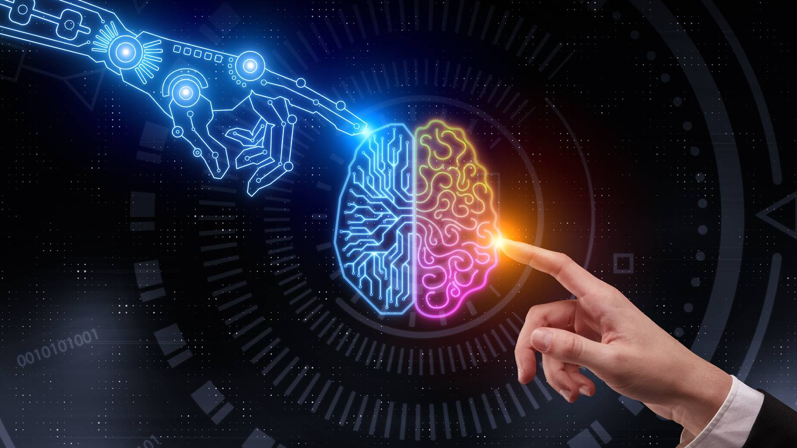
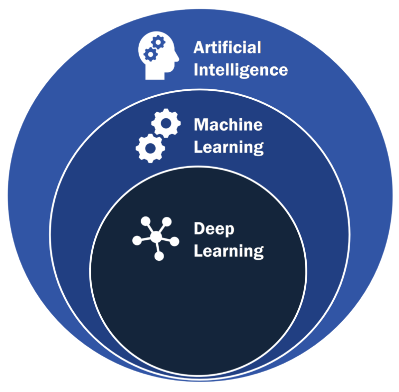
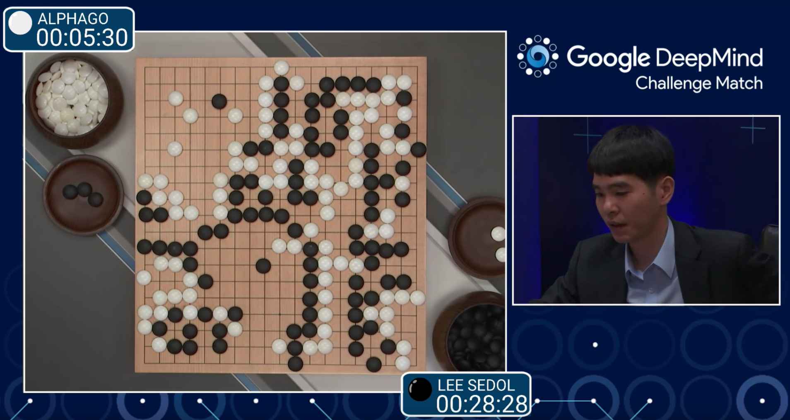
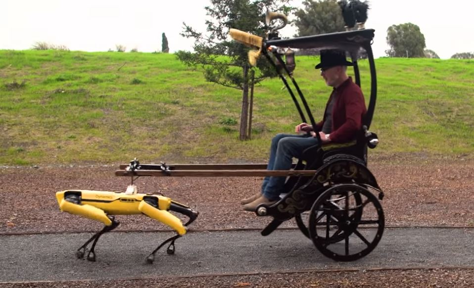
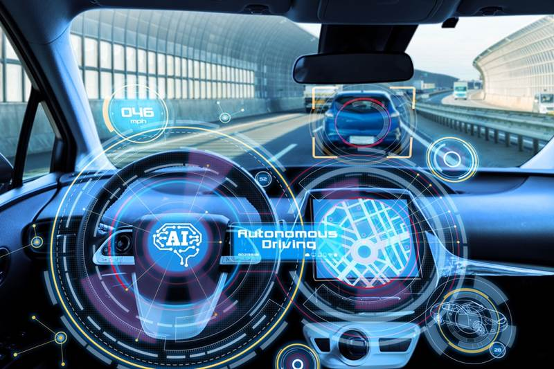
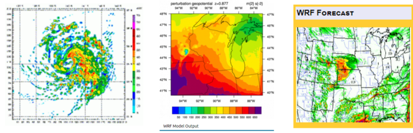
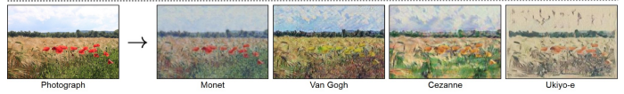
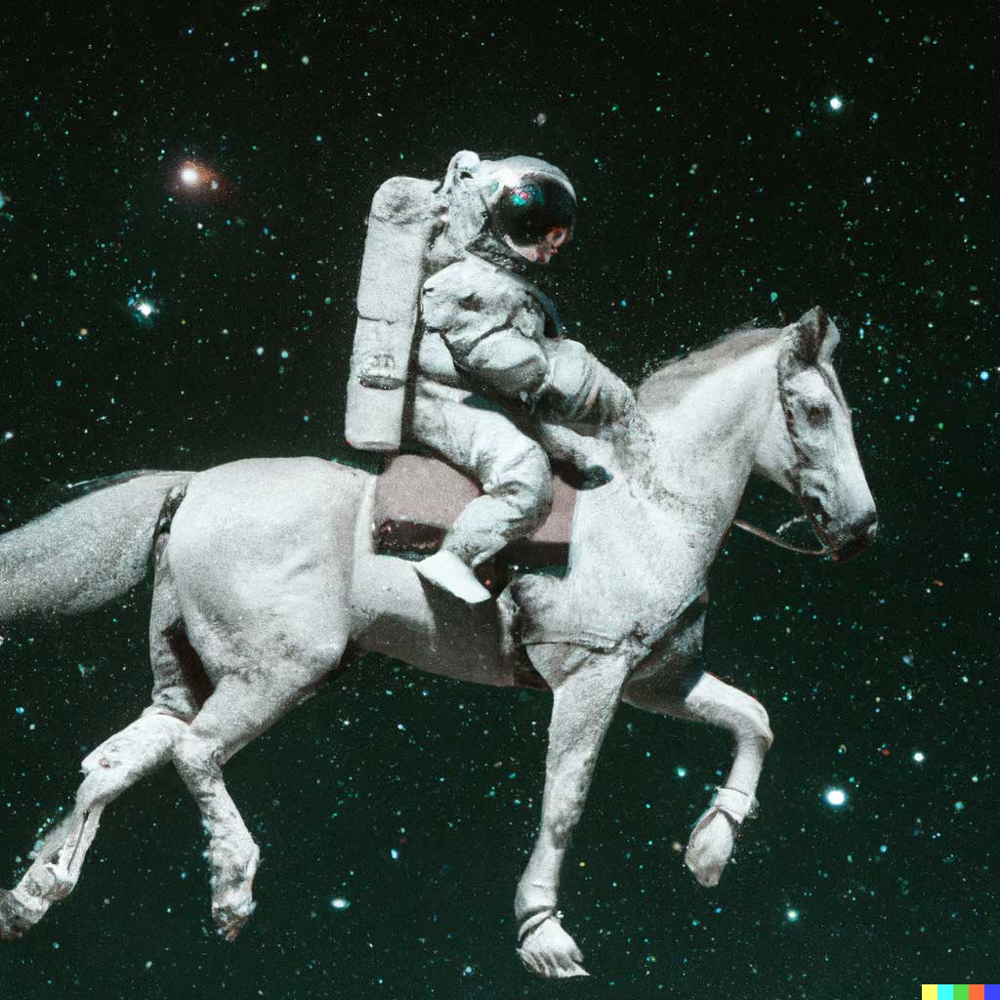

class: center, middle

# Intel·ligència artificial

 
.small[[source](https://www.documentarytube.com/articles/a-few-words-about-artificial-intelligence-what-is-it)]

Gerard Escudero i Ramon Sangüesa, 2026

---

# Informació general

.cols5050[
.col1[

### Professors

Gerard Escudero (dimarts)
gerard.escudero@upc.edu

Ramon Sangüesa (divendres)
ramon.sanguesa.i@upc.edu

### Eines

[Kaggle](https://kaggle.com)

### Avaluació

Exercicis laboratori
]
.col2[
### Contingut

1. Representació de dades (RS)

2. Reducció de dimensionalitat (RS)

3. Aprenentatge supervisat (GE)

4. Aprenentatge no supervisat (RS)

5. Optimització (RS)

6. Aprenentatge de dades complexes (GE)

7. Aprenentatge per reforç (GE)

]]

---

# Intel·ligència artificial

.blue[La nostra definició]:

Automatització de tasques cognitives:

- Percepció

- Aprenentatge

- Raonament

.blue[Exemples]:

- Reconèixer matricules

- Jugar a escacs

---

# Machine Learning

.cols5050[
.col1[
.blue[Aprenentatge automàtic]:

- models de les dades

- milloren amb l'experiència

- no hi ha intervenció humana

.blue[Aprenentatge profund]:

- tenen les xarxes neuronals com a component principal

- permeten arquitectures complexes per
  
  - grans conjunts de dades
  
  - estructures de dades molt complexes
]
.col2[
.center[
 
.small[[source](https://blog.oursky.com/2020/05/07/artificial-intelligence-ai-for-businesses-what-you-need-to-know-before-starting-an-ai-project/ai-vs-ml-vs-dl/) ]
]]]

---

# Algunes aplicacions

.cols5050[
.col1[
.center[
.blue[AlphaGo] .small[([source](https://www.popularmechanics.com/technology/a19844/googles-alphago-ai-wins-first-round-against-go-champion/))] 

.blue[Boston Dynamics] .small[([source](https://bgr.com/science/spot-robot-boston-dynamics-tested-adam-savage-5792513/))] 

]
]
.col2[
.center[
.blue[Conducció automàtica] .small[([source](https://www.techopedia.com/the-5-most-amazing-ai-advances-in-autonomous-driving/2/33178))] 
 

.blue[Predicció del temps] .small[([source](https://towardsdatascience.com/how-deep-learning-is-helping-weather-predictions-and-climate-models-389ba226b7ab))] 

]
]]
.center[
.blue[CycleGAN] .small[([source](https://jonathan-hui.medium.com/gan-some-cool-applications-of-gans-4c9ecca35900))]  
]

---

# Imatges i llenguatge natural

.cols5050[
.col1[
**Dall-e 2**:

[https://openai.com/dall-e-2/](https://openai.com/dall-e-2/)

**Example**:

`An astronaut riding a horse in a photorealistic style`

.center[]
]
.col2[
**Stable Difusion**: open-source

[https://stablediffusionweb.com/](https://stablediffusionweb.com/)

.center[]
]]

---

# ChatGPT 

Xat de OpenAI: [https://openai.com/blog/chatgpt/](https://openai.com/blog/chatgpt/)

Exemple:

