class: center, middle

## Intel·ligència Artificial

# Espais latents

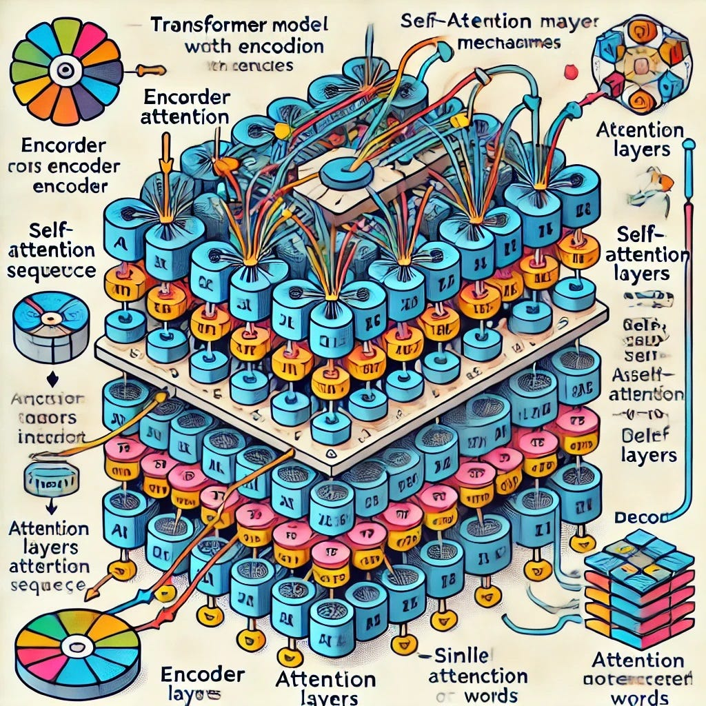

.small[[font](https://medium.com/@gunkurnia/introduction-to-transformers-deep-learning-in-machine-learning-a-comprehensive-guide-eec069d59fd2)]

Gerard Escudero, 2026


---
class: left, middle, inverse

# Índex

- .cyan[Espais latents] 

- Imatges

- Llenguatge Natural

- *Transformers*

- Espais latents mixtes

- Referències

---

# Espais latents

.blue[Espai latent] és un tipus d'espai vectorial associat a les xarxes neuronals: 

- Normalment està relacionat amb l'espai de representació de les sortides d'una xarxa neuronal o una de les seves parts (capes).

- Els objectes similars estaran ubicats en posicions properes.

- Tenen dimensions, podem aplicar distàncies o similituts i, fins i tot algebres.

---

# *Autoencoders*

.center[
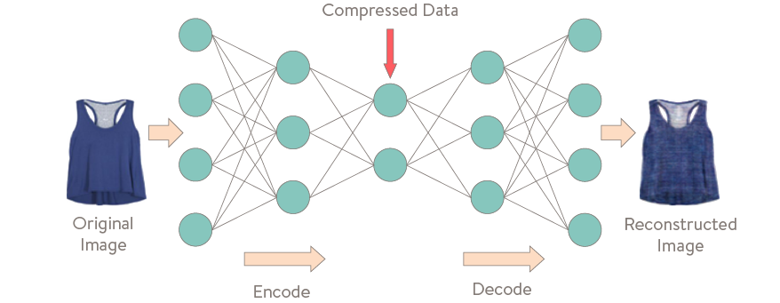<br>
.red[[font](https://multithreaded.stitchfix.com/blog/2015/09/17/deep-style/)]
]

- Sortida = entrada! (aprenentatge no supervisat)

- Capa de codificació < dades reals → compressió (amb pèrdua)

  - reducció de dimensionalitat

- La part més important de l'*autoencoder* és l'.blue[espai latent] (espai de sortida) de la capa central.

---

# Exemple

Projecció 2D i comparació amb PCA:

```python
encoder = nn.Linear(4, 2)
decoder = nn.Linear(2, 4)
autoencoder = nn.Sequential(encoder, decoder).to(device)
```
No tenen funcions d'activació per matenir-la linial (com el PCA).

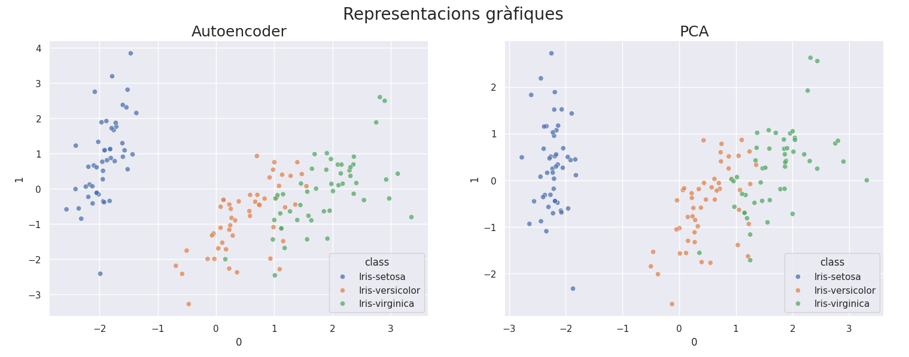

[Codi exemple](codis/autoencoders.html)

---
class: left, middle, inverse

# Índex

- .brown[Espais latents]

- .cyan[Imatges]

  - .cyan[*Autoencoders*]

  - GANs

  - Models de difusió

- Llenguatge Natural

- *Transformers*

- Espais latents mixtes

- Referències

---

# *Autoencoders* convolucionals

Podem utilitzar les capes convolucionals. Exemple:

```python
conv_encoder = nn.Sequential(
    nn.Conv2d(1, 16, kernel_size=3, padding="same"), nn.ReLU(),
    nn.MaxPool2d(kernel_size=2),  # output: 16 × 14 × 14
    ...
    nn.AdaptiveAvgPool2d((1, 1)), nn.Flatten())  # output: 32

conv_decoder = nn.Sequential(
    nn.Linear(32, 16 * 3 * 3),
    nn.Unflatten(dim=1, unflattened_size=(16, 3, 3)),
    nn.ConvTranspose2d(16, 32, kernel_size=3, stride=2), nn.ReLU(),
    ...
    nn.ConvTranspose2d(16, 1, kernel_size=3, stride=2, padding=1,
                       output_padding=1), nn.Sigmoid())

conv_ae = nn.Sequential(conv_encoder, conv_decoder).to(device)
```

.cols5050[
.col1[
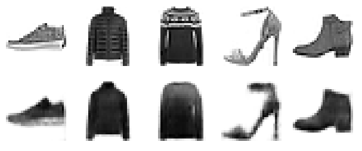
]
.col2[
.red[Font]: <br> [(Geron, 2025) *Convolutional Autoencoders*](https://github.com/ageron/handson-mlp/blob/main/18_autoencoders_gans_and_diffusion_models.ipynb).
]]

---

# *Autoencoders* per soroll

Entrenament amb parells d'exemples de dades sorolloses/netes.

.center[
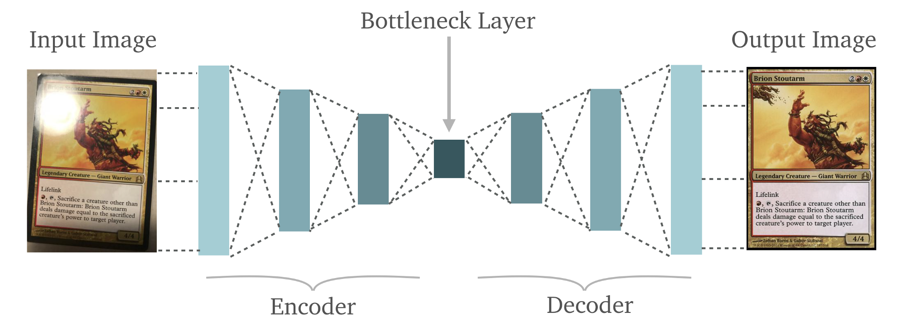<br>
.red[[font](https://medium.com/@sorenlind/a-deep-convolutional-denoising-autoencoder-for-image-classification-26c777d3b88e)]<br>
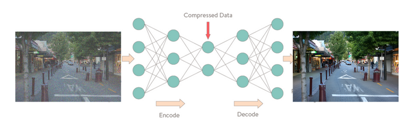<br>
.red[[font](https://towardsdatascience.com/auto-encoder-what-is-it-and-what-is-it-used-for-part-1-3e5c6f017726/)]
]

L'*autoencoder* aprèn a produir exemples nets a partir de sorollosos.

---

# *Variational autoencoders*

.center[
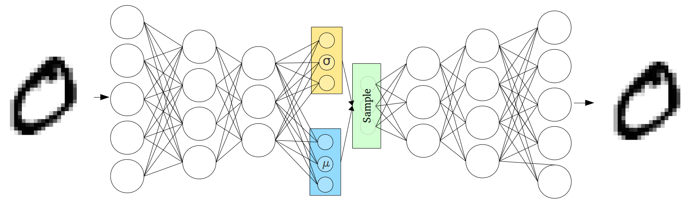
]

.center[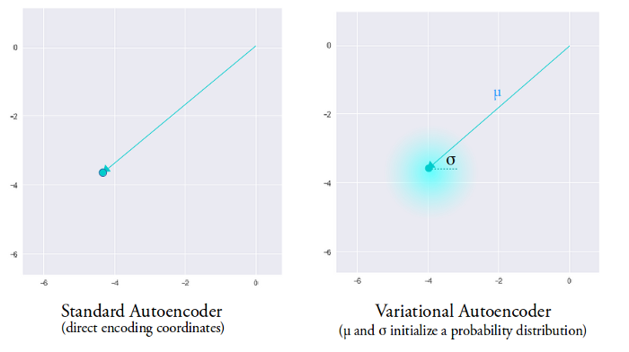]

.footnote[.red[Font]: [Intuitively Understanding Variational Autoencoders](https://towardsdatascience.com/intuitively-understanding-variational-autoencoders-1bfe67eb5daf)]

---

# *Variational autoencoders*

- Model generatiu per imatges

  - L'espai latent és "continu"

.center[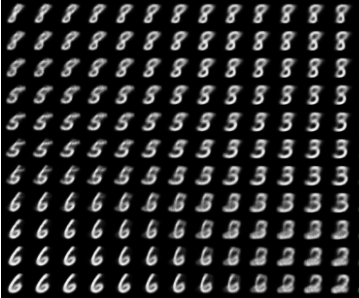]

- Codis exemple:

  - [(Geron, 2025) *Variational Autoencoder*](https://github.com/ageron/handson-mlp/blob/main/18_autoencoders_gans_and_diffusion_models.ipynb)

  - [Uncovering Anomalies with Variational Autoencoders (VAE)](https://towardsdatascience.com/uncovering-anomalies-with-variational-autoencoders-vae-a-deep-dive-into-the-world-of-1b2bce47e2e9/)


---

# Àlgebra amb imatges

.center[
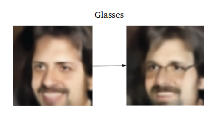

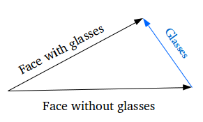
]

.footnote[.red[Font]: [Intuitively Understanding Variational Autoencoders](https://towardsdatascience.com/intuitively-understanding-variational-autoencoders-1bfe67eb5daf)]

---

# Atributs latents com a probabilitats

.center[
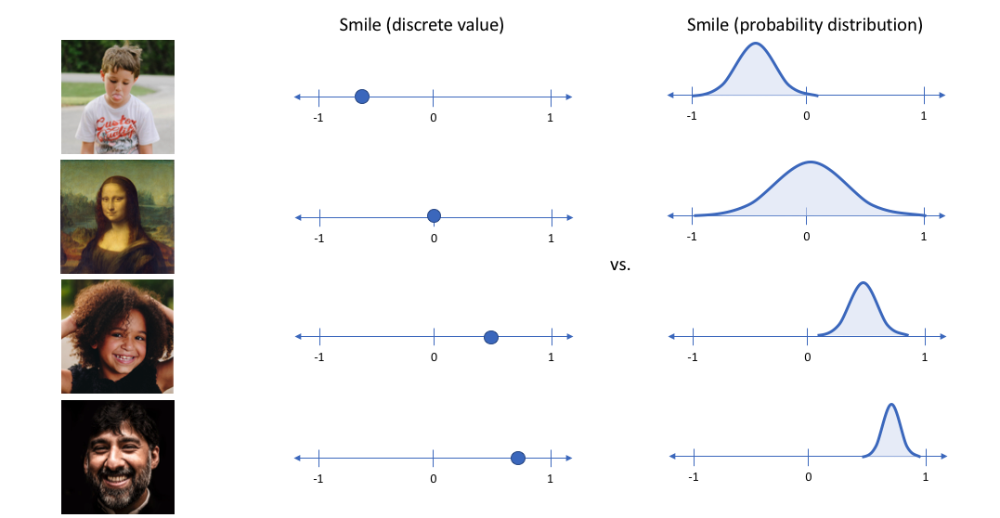<br>
.red[[font](https://www.jeremyjordan.me/variational-autoencoders/)]
]

---
class: left, middle, inverse

# Índex

- .brown[Espais latents]

- .cyan[Imatges]

  - .brown[*Autoencoders*]

  - .cyan[GANs]

  - Models de difusió

- Llenguatge Natural

- *Transformers*

- Espais latents mixtes

- Referències

---

# *Generative Adversarial Networks*

.center[
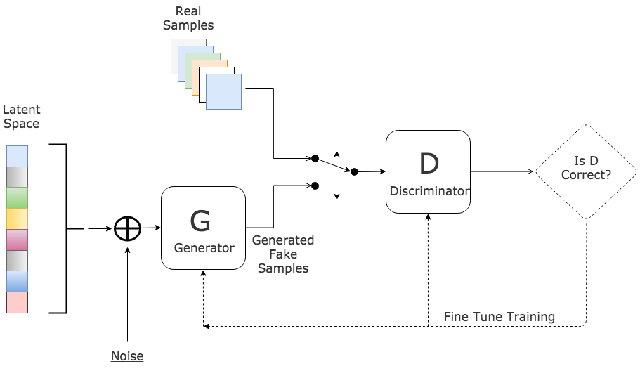<br>
.red[[font](https://www.kdnuggets.com/2017/01/generative-adversarial-networks-hot-topic-machine-learning.html)]
]

- [Introduction to Generative Adversarial Networks (GANs)](https://learnopencv.com/introduction-to-generative-adversarial-networks/)

- [(Geron, 2015) *Generative Adversarial Networks*](https://github.com/ageron/handson-mlp/blob/main/18_autoencoders_gans_and_diffusion_models.ipynb)

---

# *Generative Adversarial Networks*

.center[
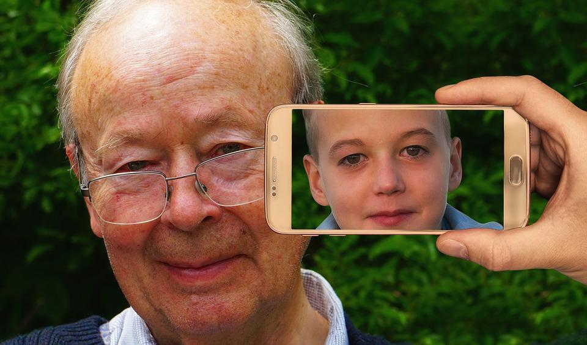<br><br>
.red[[font](https://blog.eduonix.com/artificial-intelligence/grand-finale-applications-gans/)]
]

---

# *Generative Adversarial Networks*

### Exemple

- [Aquestes persones no existeixen](https://thispersondoesnotexist.com/)

.center[


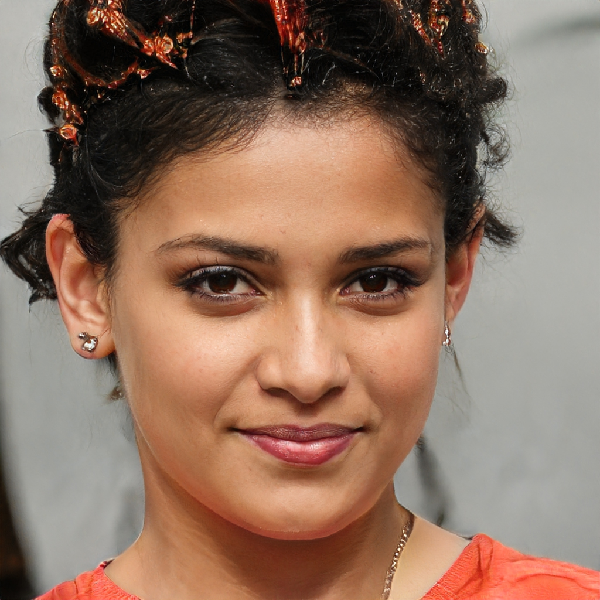
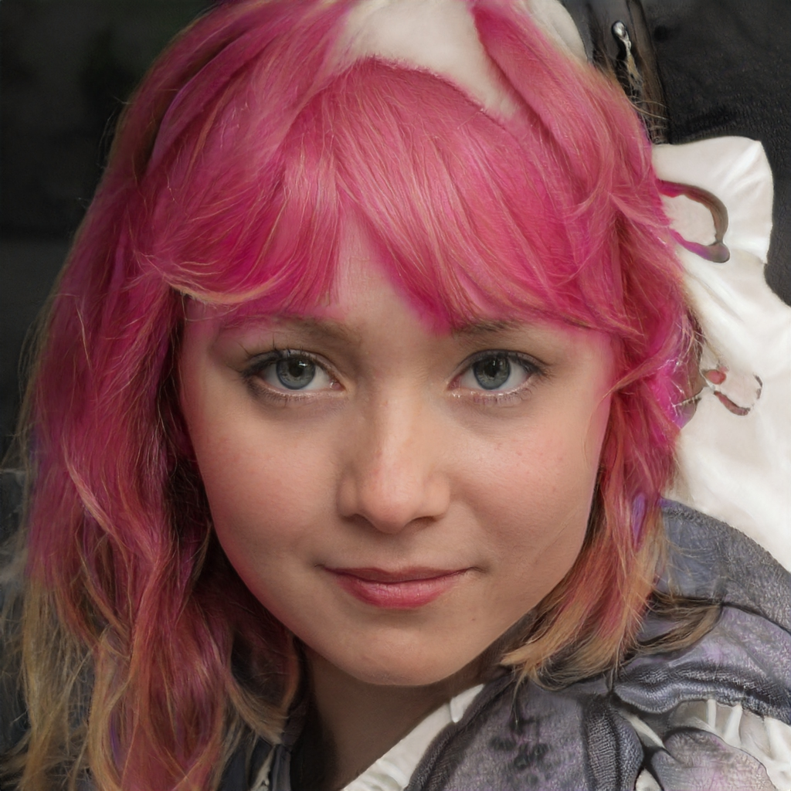
]

- Tero Karras et al., [Anàlisi i Millora de la Qualitat d'Imatge de StyleGAN](https://arxiv.org/pdf/1912.04958.pdf) (2020).

### Celebritats

- [Conjunt de Dades CelebA](http://mmlab.ie.cuhk.edu.hk/projects/CelebA.html)

---
class: left, middle, inverse

# Índex

- .brown[Espais latents]

- .cyan[Imatges]

  - .brown[*Autoencoders*]

  - .brown[GANs]

  - .cyan[Models de difusió]

- Llenguatge Natural

- *Transformers*

- Espais latents mixtes

- Referències

---

# Models de difusió

- Partim d'imatges amb les que es va afegint soroll gaussià en $T$ pasos amb mitjana $0$ i desviació $\beta$ (procés $q$ de la figura).

.center[
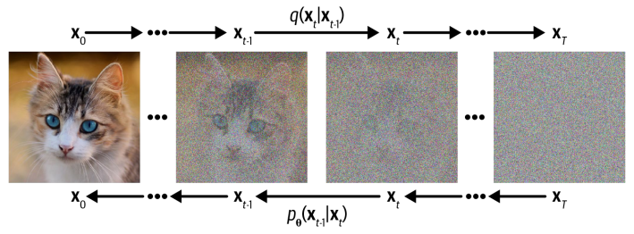
]

- I s'entrena un pas (de $t$ al $t-1$) del procés invers (procés $p_\theta$ de la figura).

- Per generar una nova imatge, generem una imatge $x_T$ amb distribució gaussiana (promig 0 i desviació 1) i apliquem $T$ passos inversos.

- Actualment es fa directament amb espais latents.

[(Geron, 2025) *Diffusion Models*](https://github.com/ageron/handson-mlp/blob/main/18_autoencoders_gans_and_diffusion_models.ipynb).

---
class: left, middle, inverse

# Índex

- .brown[Espais latents]

- .brown[Imatges]

- .cyan[Llenguatge Natural]

- *Transformers*

- Espais latents mixtes

- Referències

---

# Llenguatge Natural

Exemple: .blue[spaCy] ([https://spacy.io/](https://spacy.io/))

```python3
import spacy
nlp = spacy.load("en_core_web_sm")   # ca_core_news_sm

sentence = "Mark Pedersen and John Smith are working at Google since 1994 for $1000 per week."
doc = nlp(sentence)
```
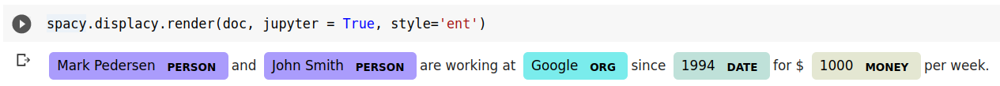

```
[(token.text, token.pos_, token.tag_, token.lemma_, token.is_stop, 
  token.ent_iob_, token.ent_type_) for token in doc]

[('Mark', 'PROPN', 'NNP', 'Mark', False, 'B', 'PERSON'),
 ('Pedersen', 'PROPN', 'NNP', 'Pedersen', False, 'I', 'PERSON'),
 ('and', 'CCONJ', 'CC', 'and', True, 'O', ''),
 ('John', 'PROPN', 'NNP', 'John', False, 'B', 'PERSON'),
 ('Smith', 'PROPN', 'NNP', 'Smith', False, 'I', 'PERSON'),
 ('are', 'AUX', 'VBP', 'be', True, 'O', ''),
 ('working', 'VERB', 'VBG', 'work', False, 'O', ''),
 ('at', 'ADP', 'IN', 'at', True, 'O', ''),
 ('Google', 'PROPN', 'NNP', 'Google', False, 'B', 'ORG'),
 ('since', 'SCONJ', 'IN', 'since', True, 'O', ''),
 ('1994', 'NUM', 'CD', '1994', False, 'B', 'DATE'),
 ('for', 'ADP', 'IN', 'for', True, 'O', ''),
 ('$', 'SYM', '$', '$', False, 'O', ''),
 ('1000', 'NUM', 'CD', '1000', False, 'B', 'MONEY'),
 ('per', 'ADP', 'IN', 'per', True, 'O', ''),
 ('week', 'NOUN', 'NN', 'week', False, 'O', ''),
 ('.', 'PUNCT', '.', '.', False, 'O', '')]
```

---

# *Bag of words*

.cols5050[
.col1[
.blue[corpus] (conjunt de dades)

- This is the first document.
- This document is the second document.
- And this is the third one.
- Is this the first document?


.blue[matriu] (per a l'aprenentatge)

0 1 1 1 0 0 1 0 1 <br>
0 2 0 1 0 1 1 0 1 <br>
1 0 0 1 1 0 1 1 1 <br>
0 1 1 1 0 0 1 0 1 <br>
]
.col2[
.blue[paraules] (vocabulari o diccionari)

| índex | paraula |
|---|---|
| 0 | and |
| 1 | document | 
| 2 | first |
| 3 | is |
| 4 | one |
| 5 | second |
| 6 | the |
| 7 | third |
| 8 | this |

]
]

Font: [sklearn CountVectorizer](https://scikit-learn.org/stable/modules/generated/sklearn.feature_extraction.text.CountVectorizer.html)

---

# Enfocament clàssic

- [Filtratge de Correu Brossa per SMS](https://archive.ics.uci.edu/ml/datasets/SMS+Spam+Collection)
```
    ham Siva is in hostel aha:-.
    ham Cos i was out shopping wif darren jus now n i called him 2 ask wat present he wan lor. Then he started guessing who i was wif n he finally guessed darren lor.
    spam FreeMsg: Txt: CALL to No: 86888 & claim your reward of 3 hours talk time to use from your phone now! ubscribe6GBP/ mnth inc 3hrs 16 stop?txtStop
    spam Sunshine Quiz! Win a super Sony DVD recorder if you canname the capital of Australia? Text MQUIZ to 82277. B
```

- *CountVectorizer* <br>
```
    from sklearn.feature_extraction.text import CountVectorizer

    cv = CountVectorizer(lowercase=False, min_df=2)

    Xtrn = cv.fit_transform(train)
    Xtst = cv.transform(test)
```

- [codi sklearn](codis/sms.html) (SVM & CountVectorizer)

---

# *Word Embeddings*

.blue[Àlgebra sobre paraules]

.center[
`King – Man + Woman = Queen`<br>
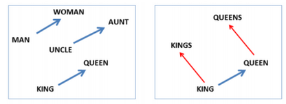<br>
[font](https://towardsml.wordpress.com/2018/06/12/understanding-word-embeddings/)
]

Capa .blue[embedding]:
```python
self.embed = nn.Embedding(vocab_size, embed_dim)
self.gru = nn.GRU(embed_dim, hidden_dim, num_layers=n_layers,
                  batch_first=True, dropout=dropout)
```
[(Geron, 2025) *Embeddings*](https://github.com/ageron/handson-mlp/blob/main/14_nlp_with_rnns_and_attention.ipynb)

.blue[*Word Embeddings* preentrenats]:
- [GloVe](https://nlp.stanford.edu/projects/glove), [Word2Vec](https://code.google.com/archive/p/word2vec)...

---
class: left, middle, inverse

# Índex

- .brown[Espais latents]

- .brown[Imatges]

- .brown[Llenguatge Natural]

- .cyan[*Transformers*]

  - .cyan[Arquitectura]

  - *Encoders*

  - *Decoders*

- Espais latents mixtes

- Referències

---

# *Transformer*

Models de .blue[seqüència a seqüència]

.cols5050[
.col1[
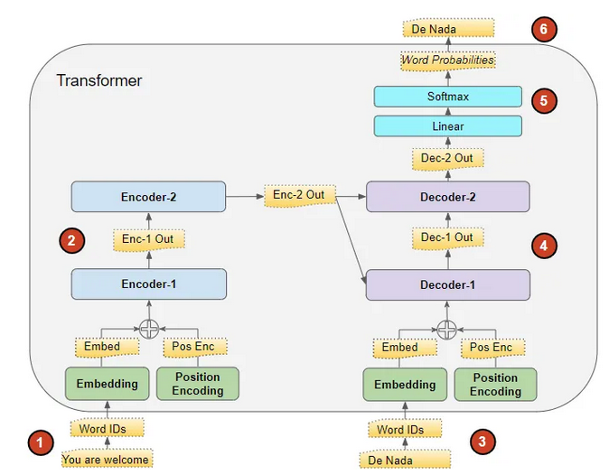<br>
[Transformers Explained Visually](https://towardsdatascience.com/transformers-explained-visually-part-1-overview-of-functionality-95a6dd460452)
]
.col2[
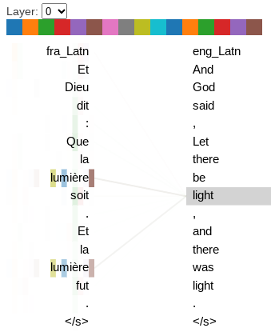<br>
[Practical Word Alignment (LLM)](https://looiwenli.com/blog/practical-word-alignment-llm)
]]

---

# Atenció

Aprèn quines paraules de l'entrada hi estan relacionades.

.center[
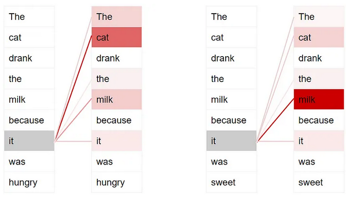<br>
[Transformers Explained Visually](https://towardsdatascience.com/transformers-explained-visually-part-1-overview-of-functionality-95a6dd460452)
]

- Ashish Vaswani et al., [Attention Is All You Need](https://arxiv.org/abs/1706.03762) (2017).

---

# Tasques

.center[
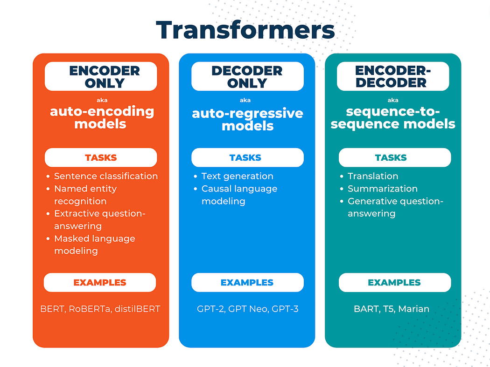<br>
[Explainable AI: Visualizing Attention in Transformers](https://mlops.community/explainable-ai-visualizing-attention-in-transformers/)
]

---
class: left, middle, inverse

# Índex

- .brown[Espais latents]

- .brown[Imatges]

- .brown[Llenguatge Natural]

- .cyan[*Transformers*]

  - .brown[Arquitectura]

  - .cyan[*Encoders*]

  - *Decoders*

- Espais latents mixtes

- Referències

---

# *Encoders*

*Bidirectional Encoder Representations from Transformers* (.blue[BERT])

- Codifica el context d'una paraula donada (*Embeddings Contextuals* o *Sentence Embeddings*)

- Utilitza el mecanisme d'atenció

- Jacob Devlin et al., [BERT: Preentrenament de Transformadors Bidireccionals Profunds per a la Comprensió del Llenguatge](https://arxiv.org/pdf/1810.04805.pdf) (2019).

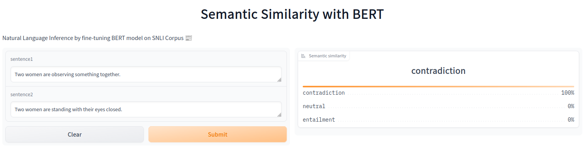
[https://huggingface.co/spaces/keras-io/bert-semantic-similarity](https://huggingface.co/spaces/keras-io/bert-semantic-similarity)

---

# *Encoders*

- Modelatge de llenguatge emmascarat

.center[
<br>
[https://huggingface.co/bert-base-uncased](https://huggingface.co/bert-base-uncased)
]

---

# *Encoders*

.blue[Model base RoBERTa en català]: <br>

.center[
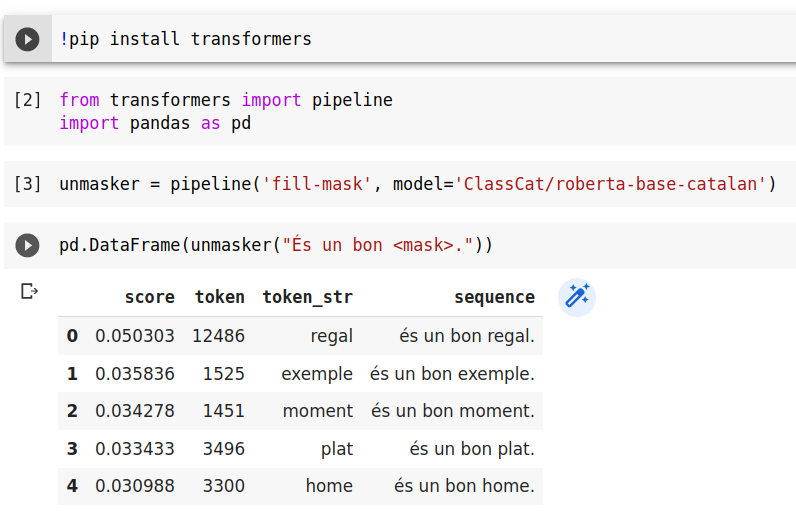<br>
[https://huggingface.co/ClassCat/roberta-base-catalan](https://huggingface.co/ClassCat/roberta-base-catalan)
]

---

# Encoder

Exemple amb BERT multilingüe:

```python3
...

# baixada del model
base = SentenceTransformer('distiluse-base-multilingual-cased-v2')

...

# conjunts a comparar
tq = model.encode(["La dona vigila la nena."], normalize_embeddings=True)
tr = model.encode(["La nena mira com juga el gos.",
                   "El nen juga a pilota." ], normalize_embeddings=True)

...

# càlcul de similitut
cosine_similarity(tq,tr)

👉  [0.59425473, 0.32421875]
```

[Codi sencer](codis/bert-similarity.html) / [model](https://huggingface.co/sentence-transformers/distiluse-base-multilingual-cased-v2)

---
class: left, middle, inverse

# Índex

- .brown[Espais latents]

- .brown[Imatges]

- .brown[Llenguatge Natural]

- .cyan[*Transformers*]

  - .brown[Arquitectura]

  - .brown[*Encoders*]

  - .cyan[*Decoders*]

- Espais latents mixtes

- Referències

---

# Grans models de llenguatge (*LLMs*)

.cols5050[
.col1[
.blue[Tasques]: predicció de

- quina paraula ve a continuació

- una paraula emmascarada al mig
]
.col2[<br>
- [GPT-2 a Hugging Face](https://huggingface.co/gpt2)

- [Referència GPT-3](https://arxiv.org/pdf/2005.14165.pdf)
]]

.blue[Temperatura]: amb quina freqüència s'usaran les paraules de menor rang (0.8 per a assajos)

.center[
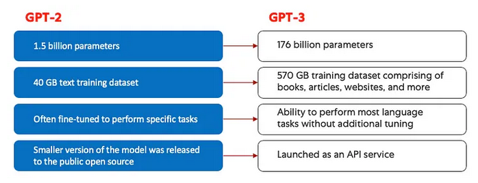<br>
[Com Funciona ChatGPT](https://towardsdatascience.com/how-chatgpt-works-the-models-behind-the-bot-1ce5fca96286)
]

---

# Exemple de *Finetuning*

*Finetuning* de .blue[GPT2] per generar textos en l'estil de .blue[Lord Byron]:

- Conjunt de dades: llibres de Lord Byron del [Projecte Gutenberg](https://www.gutenberg.org/)

- [Entrenament](codis/GPT2LordByron.html) / [Generació](codis/UseLordByron.html)
```
Lady Moon is dancing on the sky,
      And her lovely wings[276] come down,
      And speak to the scenes which they gaze,
      And grieve for those whom they love.

                                                            _March_ 2, 1819._
```

- .red[Font]: [gpt-2-simple](https://github.com/minimaxir/gpt-2-simple) de Max Woolf

Vegeu també:

- [(Geron, 2025) *Decoder-Only Transformers*](https://github.com/ageron/handson-mlp/blob/main/15_transformers_for_nlp_and_chatbots.ipynb)

- David Arméstar. [Adaptació de grans models de llenguatge per a aplicacions en àmbits limitats](https://upcommons.upc.edu/handle/2117/405666). 2024. [Model a HuggingFace](https://huggingface.co/Postzeun).

---

# gpt2-small-catalan-v2

GPT2 ajustat amb la Viquipèdia en català

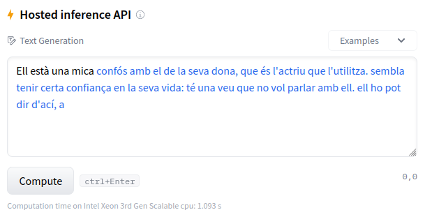<br>
.small[[https://huggingface.co/ClassCat/gpt2-small-catalan-v2](https://huggingface.co/ClassCat/gpt2-small-catalan-v2)]

---

# DeepSeek

.blue[DeepSeek]:

.cols5050[
.col1[
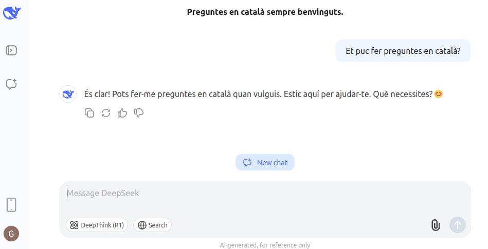<br>
[https://www.deepseek.com/](https://www.deepseek.com/)
]
.col2[
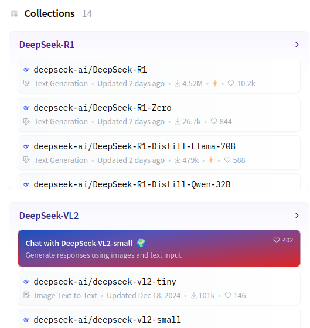<br>
[https://huggingface.co/deepseek-ai](https://huggingface.co/deepseek-ai)
]]

---
class: left, middle, inverse

# Índex

- .brown[Espais latents]

- .brown[Imatges]

- .brown[Llenguatge Natural]

- .brown[*Transformers*]

- .cyan[Espais latents mixtes]

- Referències

---

# *Generative Adversarial Networks*

.blue[GAN]:

- Origen: text

- Destí: imatge

.center[
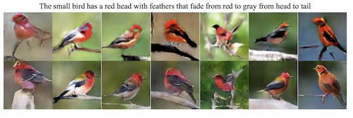<br>
.red[[font](https://blog.eduonix.com/artificial-intelligence/grand-finale-applications-gans/)]
]

---

# Stable Diffusion

Codi obert: https://stablediffusionweb.com/

.center[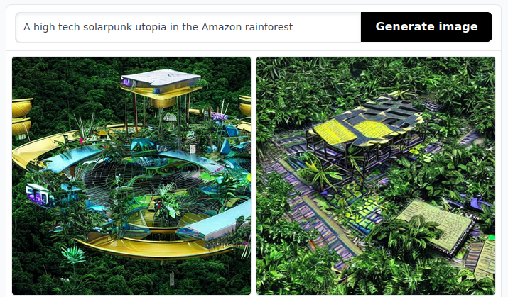]

A Hugging Face Hub: [https://huggingface.co/stabilityai/stable-diffusion-2](https://huggingface.co/stabilityai/stable-diffusion-2)

---

# Stable Diffusion

.blue[Execució en local]:

- [Model "stabilityai/sd-turbo"](https://huggingface.co/stabilityai/sd-turbo)

- Conté un exemple d'ús.

.cols5050[
.col1[
.blue[Exemple]:

- [(Geron, 2025) *Diffusion Models*](https://github.com/ageron/handson-mlp/blob/main/18_autoencoders_gans_and_diffusion_models.ipynb)

- Prompt: <br>"A closeup photo of an orangutan reading a book"

]
.col2[
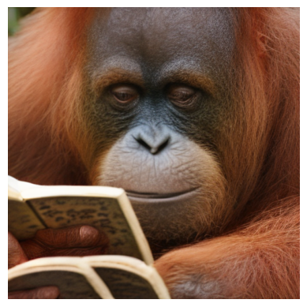
]]

---

# DALLE-2

.cols5050[
.col1[
#### Entrada:

`An astronaut riding a horse in a photorealistic style`
]
.col2[
#### Referència:

https://openai.com/dall-e-2/
]]

#### Sortida:

.center[]

---

# Sora

.center[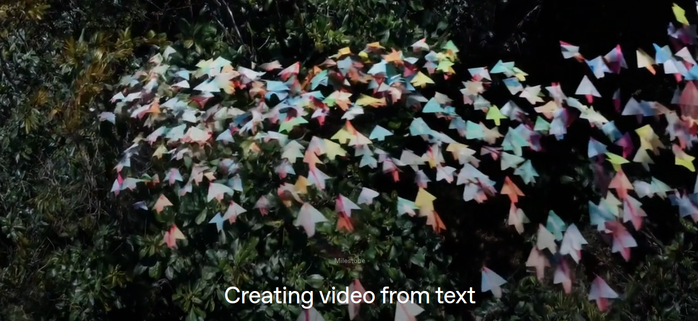]

#### Referència:

https://openai.com/index/sora/

---

# *ChatGPT*

.blue[ChatGPT]: [https://openai.com/blog/chatgpt/](https://openai.com/blog/chatgpt/)

Exemple:

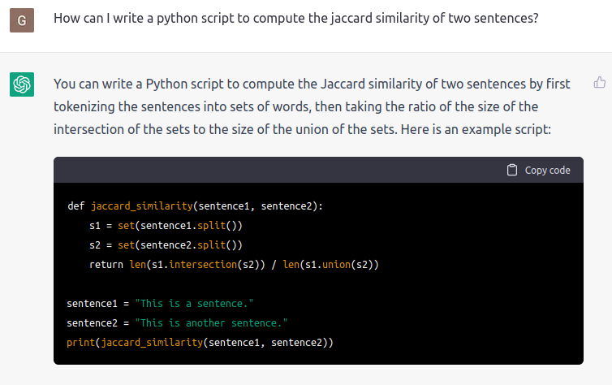

---

# DialoGPT

GPT2 ajustat amb dades de diàlegs de Reddit

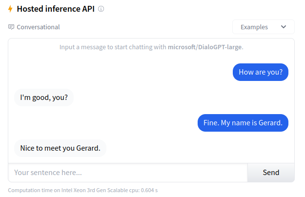<br>
.small[[https://huggingface.co/microsoft/DialoGPT-large?text=How+are+you%3F](https://huggingface.co/microsoft/DialoGPT-large?text=How+are+you%3F)]


---
class: left, middle, inverse

# Índex

- .brown[Espais latents]

- .brown[Imatges]

- .brown[Llenguatge Natural]

- .brown[*Transformers*]

- .brown[Espais latents mixtes]

- .cyan[Referències]

---

# Referència

- Aurélien Geron. *Hands-On Machine Learning with Scikit-Learn and PyTorch: Concepts, Tools, and Techniques to Build Intelligent Systems*. O'Reilly, 2025.

- Aurélien Geron. [*Hands-On Machine Learning with Scikit-Learn and PyTorch*](https://github.com/ageron/handson-mlp). Github, 2025.
