class: center, middle

## Intel·ligència Artificial

# Aprenentatge per reforç

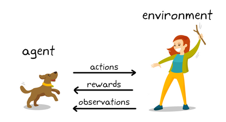 
.small[[font](https://de.mathworks.com/discovery/reinforcement-learning.html)]

Gerard Escudero & Samir Kanaan, 2026

---
class: left, middle, inverse

# Índex

* .cyan[Q-learning]

* Deep Q-learning

* Jocs Seriosos

* Fites

* Conducció automàtica

---

# Aprenentatge per reforç

.blue[aprendre a partir de comportaments i no de dades]

.cols5050[
.col1[
.center[
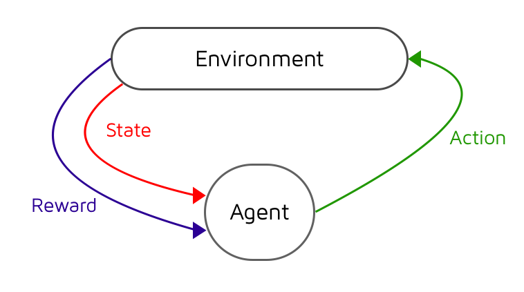 
[font](https://thomassimonini.medium.com/q-learning-lets-create-an-autonomous-taxi-part-2-2-8cbafa19d7f5)]

.blue[Bucle]: `estat` $\rightarrow$ `acció` $\rightarrow$ `recompensa`

.blue[Objectiu]: maximitzar la recompensa acumulada esperada
]
.col2[
.blue[Components]:

- un _agent_

- un conjunt d'estats $S$

- un conjunt d'accions $A$

- Recompenses $R_t$  (positives o negatives)  

.blue[Qualitat]: $Q: S \times A \to \mathbb{R}$

.blue[Policy]: $\pi(s)\rightarrow a$
]]

---

# Exemple de Q-Learning

.cols5050[
.col1[
.center[
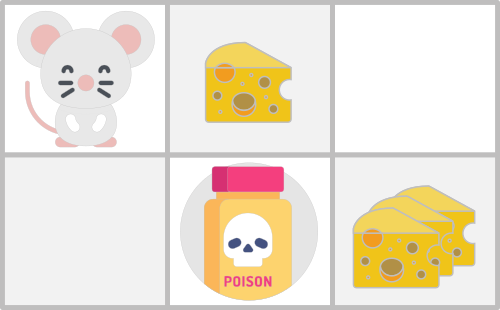 
[font](https://thomassimonini.medium.com/q-learning-lets-create-an-autonomous-taxi-part-2-2-8cbafa19d7f5)
]]
.col2[

| recompenses | descripció |
|---|---|
| +0 | sense formatge |
| +1 | formatge petit |
| +10 | munt de formatge |
| -10 | verí |
]]
.center[
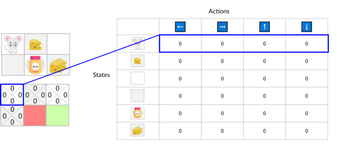
]

---

# L'equació de Bellman

.blue[Descompte]: [font](https://medium.com/swlh/an-intuitive-approach-to-q-learning-p1-acedb6dff968)

.cols5050[
.col1[
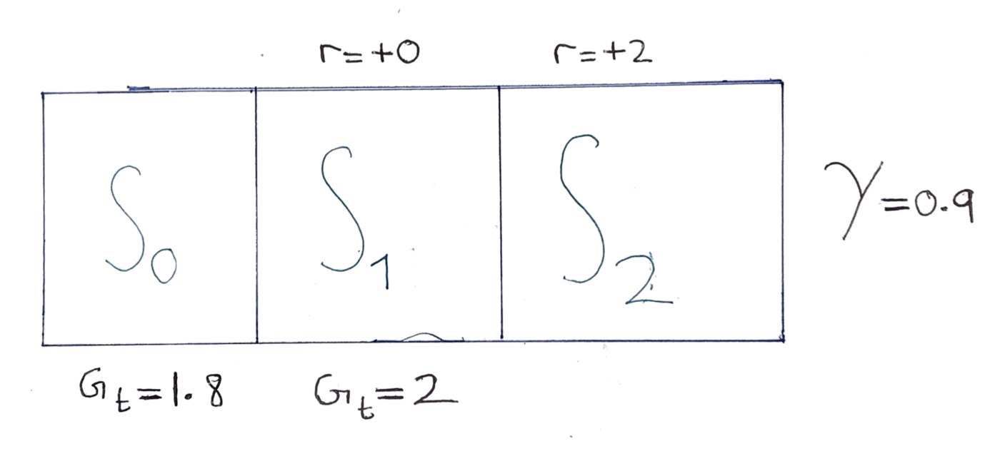
]
.col2[
 
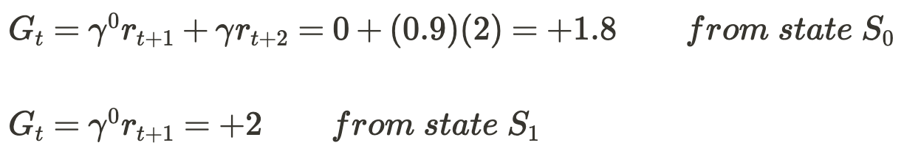
]]

.blue[Actualització]: [font](https://en.wikipedia.org/wiki/Q-learning)

.center[
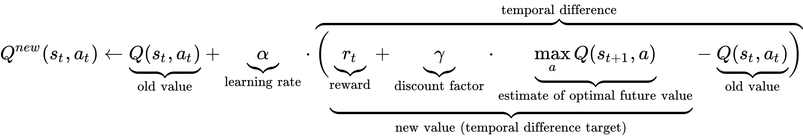
]

---

# Exemple de Q-table

.blue[Entrenament de l'exemple]: [font](https://thomassimonini.medium.com/q-learning-lets-create-an-autonomous-taxi-part-2-2-8cbafa19d7f5)

.center[
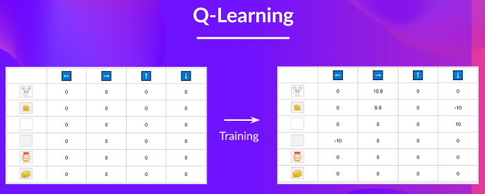 
]

- Thomas Simonini. [Q-Learning, let's create an autonomous Taxi](https://thomassimonini.medium.com/q-learning-lets-create-an-autonomous-taxi-part-1-2-3e8f5e764358), 2020.

- Tawsif Kamal. [An Intuitive Approach to Q-Learning (P1)](https://medium.com/swlh/an-intuitive-approach-to-q-learning-p1-acedb6dff968), 2021. 

---

# Exploració vs explotació

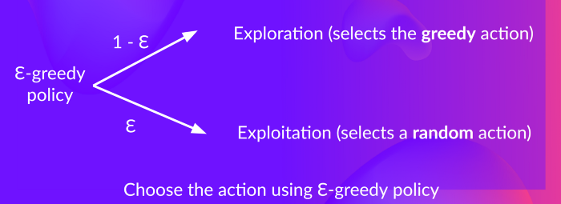

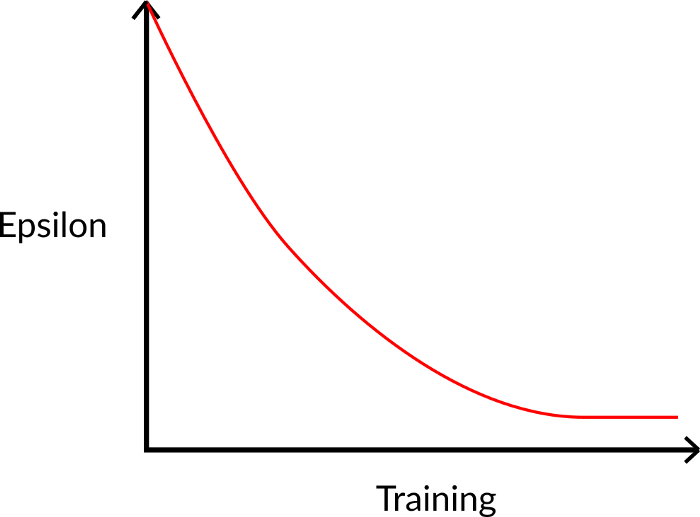

.footnote[Font: [Q-Learning, let's create an autonomous Taxi](https://thomassimonini.medium.com/q-learning-lets-create-an-autonomous-taxi-part-2-2-8cbafa19d7f5)]

---

# Gymnasium

- Col·lecció de problemes estàndard d'aprenentatge per reforç amb conexió a Python ([Documentació](https://gymnasium.farama.org/)).

- Origen: [OpenAI Gym](https://github.com/openai/gym), un conjunt d'eines per desenvolupar i comparar algorismes d'aprenentatge per reforç

.center[
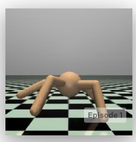 
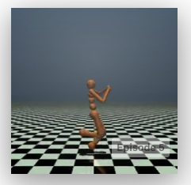 
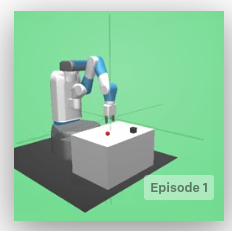 
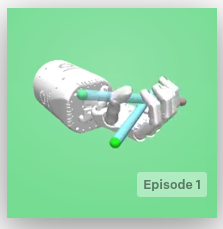  
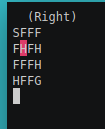 
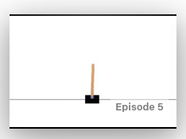 
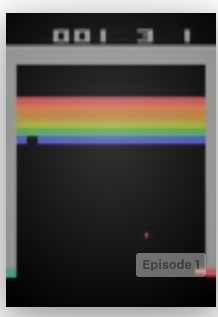 
]

- Brockman et al. [OpenAI Gym](https://arxiv.org/pdf/1606.01540), 2016.

---

# FrozenLake

[FrozenLake](https://gymnasium.farama.org/environments/toy_text/frozen_lake/) és un entorn de problema tipus laberint ([tutorial](https://gymnasium.farama.org/tutorials/training_agents/frozenlake_q_learning/)).

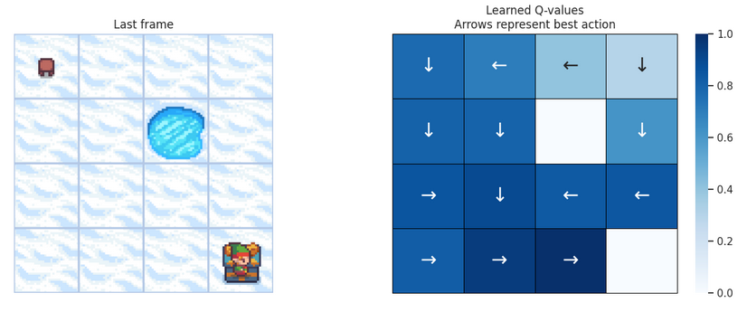 

- 4 accions (direccions) i 16 estats (posició en el tauler).

---
class: left, middle, inverse

# Índex

* .brown[Q-learning]

* .cyan[Deep Q-learning]

* Jocs Seriosos

* Fites

* Conducció automàtica

---

# Q-Learning i Deep Q-Learning

.center[
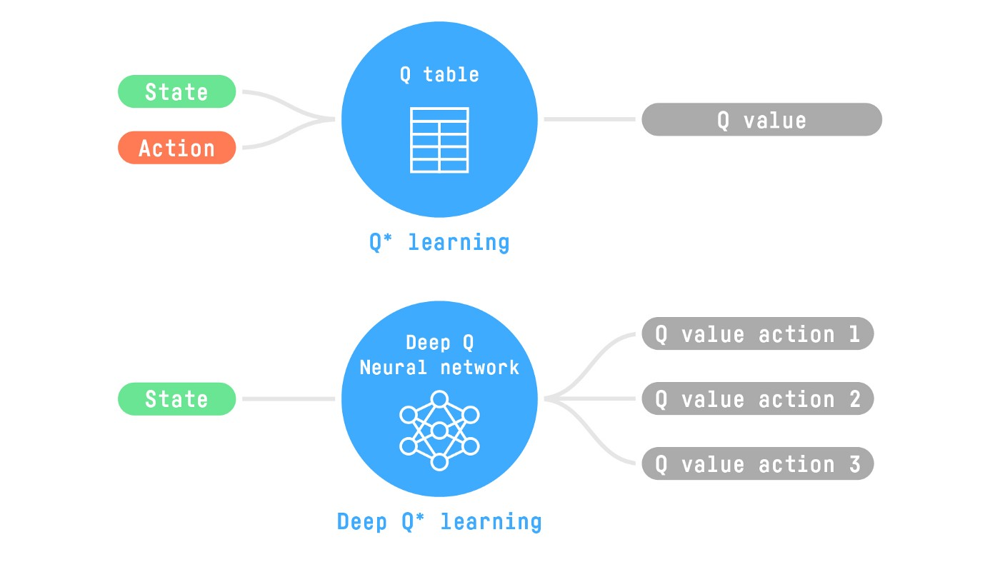 
[font](https://thomassimonini.medium.com/an-introduction-to-deep-reinforcement-learning-17a565999c0c)
]

---

# Deep Q-Learning

- Xarxa Neuronal Convolucional per aprendre taules $Q$  

.center[[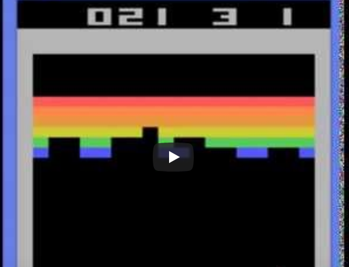](https://www.youtube.com/watch?v=TmPfTpjtdgg&feature=youtu.be)]

- [Escenari Atari breakout](https://ale.farama.org/environments/breakout/) / [exemple de codi i models](https://github.com/schwp/torch-atari)

- DeepMind. [Deep Reinforcement Learning](https://deepmind.com/blog/article/deep-reinforcement-learning).

---

# CartPole

És un punt de partida d'OpenAI per a l'Aprenentatge Profund per Reforç.

.cols5050[
.col1[
.blue[Tutorial]:

- [CartPole a Gymnasium](https://gymnasium.farama.org/environments/classic_control/cart_pole/)

- [DQN torch](https://docs.pytorch.org/tutorials/intermediate/reinforcement_q_learning.html)

.center[

]
]
.col2[
.blue[Altres algorismes]:

- Proximal Policy Optimization (PPO): descens per gradients aplicat a *policy* ([tutorial](https://docs.pytorch.org/tutorials/intermediate/reinforcement_ppo.html)).

- Asynchronous Advantage Actor-Critic (A3C): introdueix l'entrenament en paral·lel ([exemple](https://github.com/MorvanZhou/pytorch-A3C?tab=readme-ov-file)).

]]

- Aurélien Geron. [Hands-On Machine Learning with Scikit-Learn and PyTorch](https://github.com/ageron/handson-mlp/blob/main/19_reinforcement_learning.ipynb). O'Reilly, 2025.

---

# OpenAI: Hide & Seek

- Károly Zsolnai-Fehér. [OpenAI Plays Hide and Seek…and Breaks The Game!](https://www.youtube.com/watch?v=Lu56xVlZ40M). Two Minute Papers.

.center[
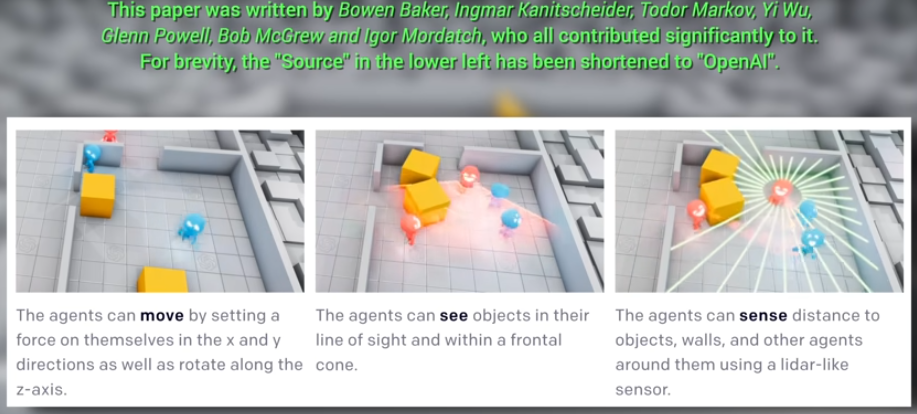
]

- Bowen Baker et al., [Emergent Tool Use from Multi-Agent Interaction](https://openai.com/blog/emergent-tool-use/), 2019.

---
class: left, middle, inverse

# Índex

* .brown[Q-learning]

* .brown[Deep Q-learning]

* .cyan[Jocs Seriosos]

* Fites

* Conducció automàtica

---

# Motor de jocs Unity 3D

[Motor de jocs Unity 3D](https://unity.com/): plataforma de desenvolupament per crear jocs 2D i 3D multiplataforma

- Design News: [Simuladors BMW](https://www.designnews.com/automotive-engineering/bmw-uses-unity-3d-create-virtual-world-autonomous-driving-development) (.blue[exemple de joc seriós])

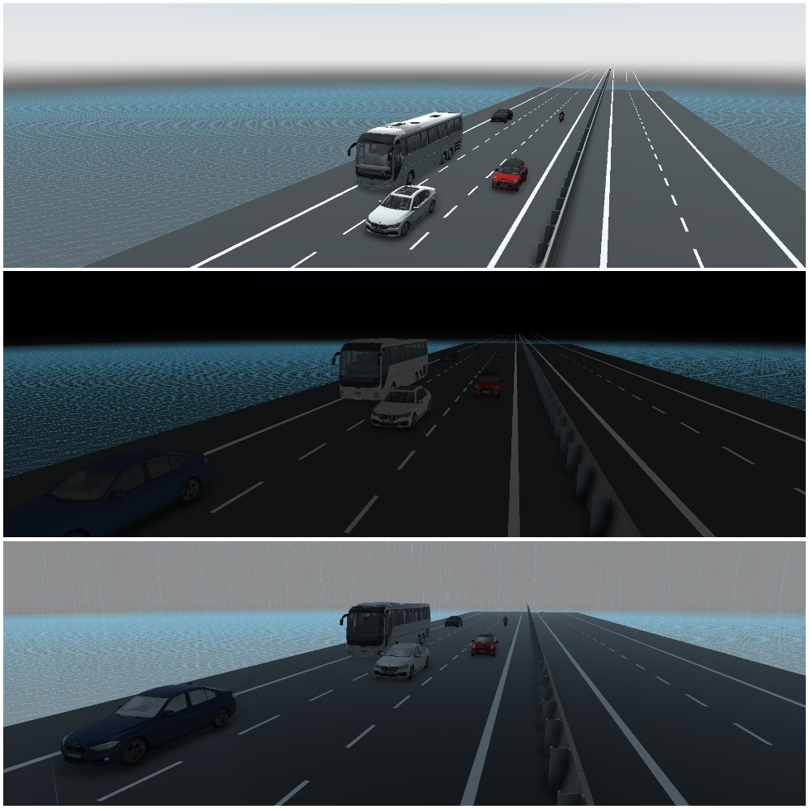
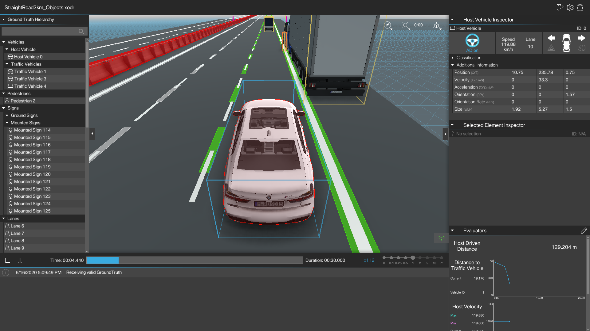 

- Juliani et al. [Unity: A General Platform for Intelligent Agents](https://arxiv.org/abs/1809.02627), 2020.

---

# Exemple de Q-learning a Unity

- Exemple senzill de Q-learning i Q-Table.

.center[[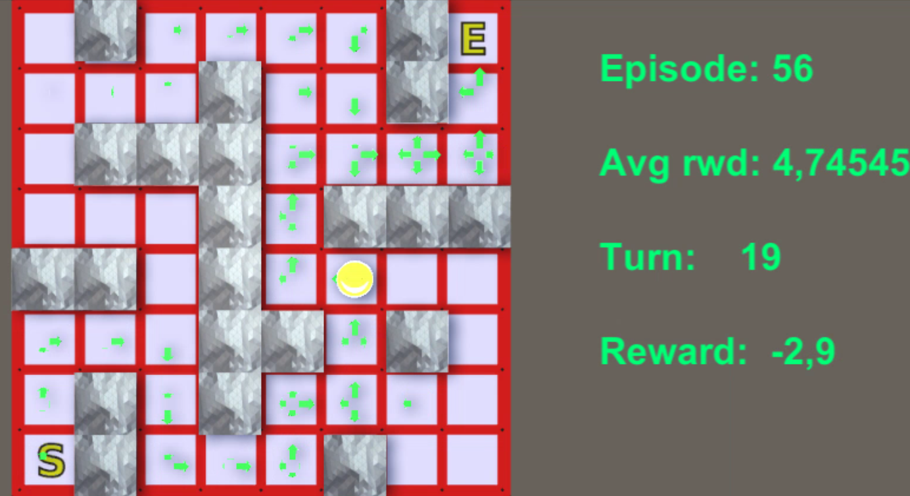](figures/reforc/mazeRL.mp4)]

- [Paquet Unity](codis/mazeRL.unitypackage) (en castellà)
  - Vegeu la carpeta _Scripts_ a _Assets_

---

# Unity ML-Agents

[ML-Agents](https://github.com/Unity-Technologies/ml-agents) permet usar simulacions com a entorns per entrenar agents

- Diverses tècniques d'aprenentatge automàtic: aprenentatge profund, aprenentatge profund per reforç (PPO), aprenentatge per curiositat...

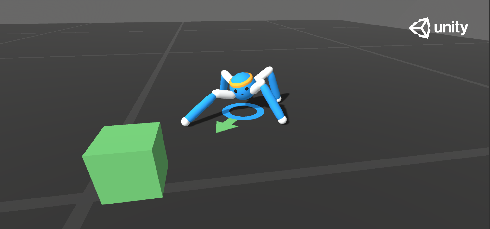 
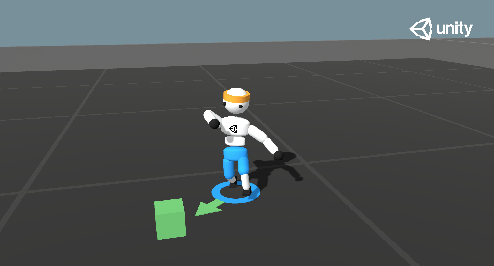 
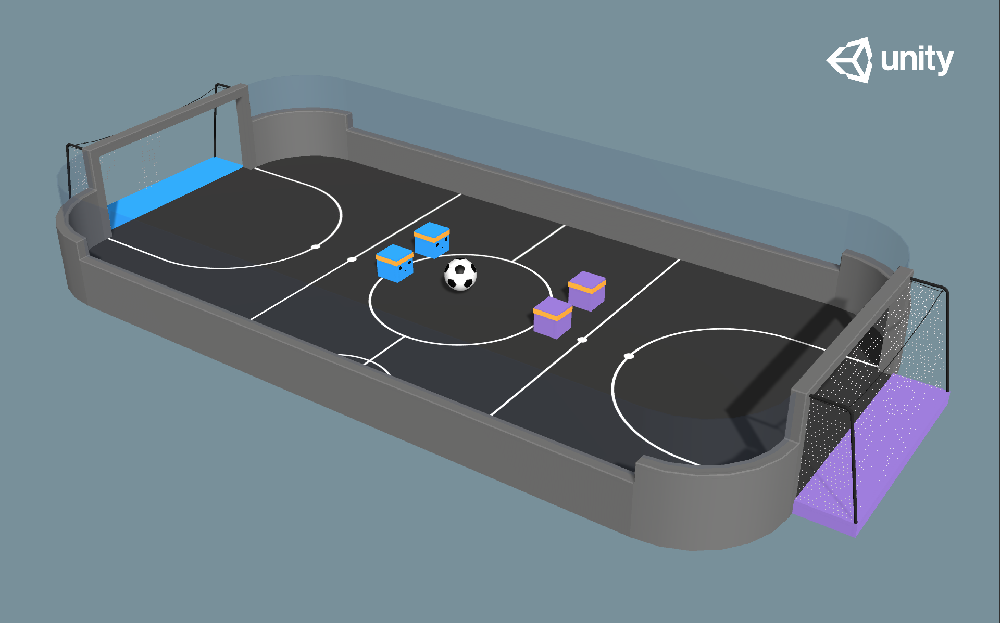 
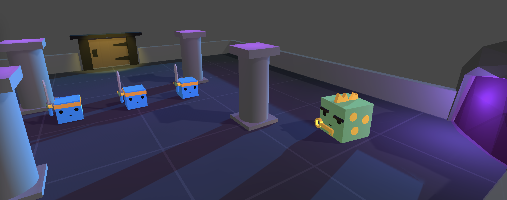 

---

# ML-Agents: documentació

- [Documentació](https://docs.unity3d.com/Packages/com.unity.ml-agents@4.0/manual/index.html)

.cols5050[
.col1[
- [Tutorial Roller Ball](https://docs.unity3d.com/Packages/com.unity.ml-agents@4.0/manual/Learning-Environment-Create-New.html)

.center[
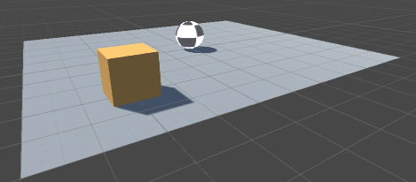 
[Exemple en vídeo](figures/reforc/RollerBall.mp4)]
]
.col2[

- Col·laboració entre agents

.center[
[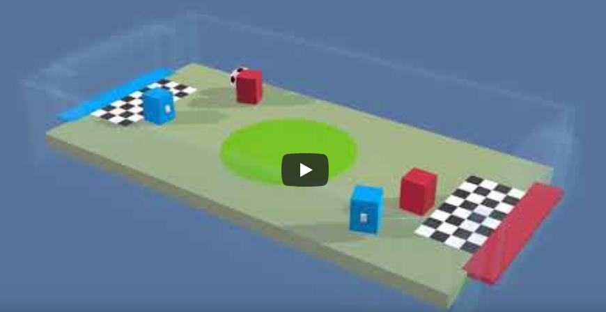](https://www.youtube.com/watch?v=Hg3nmYD3DjQ&feature=youtu.be)]
]]

---
class: left, middle, inverse

# Índex

* .brown[Q-learning]

* .brown[Deep Q-learning]

* .brown[Jocs Seriosos]

* .cyan[Fites]

* Conducció automàtica

---

# Jocs tradicionals

.cols5050[
.col1[
- [AlphaZero](https://deepmind.com/blog/article/alphazero-shedding-new-light-grand-games-chess-shogi-and-go), 2017: Shogi, escacs i Go
]
.col2[
| Joc | Complexitat (estats) |
|------|------------|
| Escacs | $10^{120}$ |
| Go   | $10^{170}$ |
]]

.center[
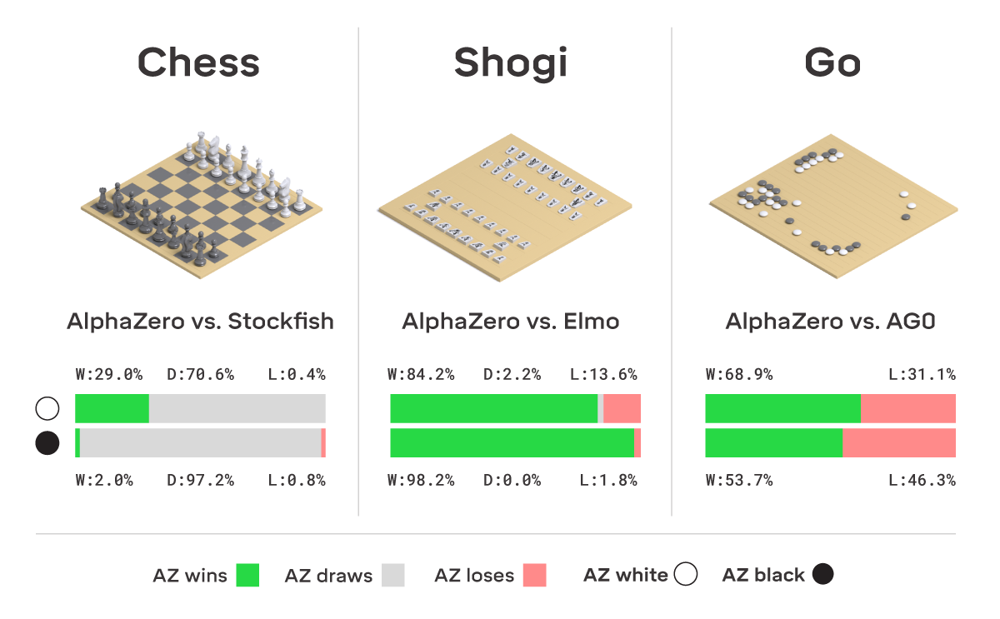
]

- David Silver et al. [A general reinforcement learning algorithm that masters chess, shogi and Go through self-play](https://discovery.ucl.ac.uk/id/eprint/10069050/1/alphazero_preprint.pdf), 2018.

---

# Visió per computador

.cols5050[
.col1[
.blue[Deep Q-Learning per a Atari Breakout]

.center[
]

- DeepMind Blog. [Deep Reinforcement Learning](https://deepmind.com/blog/article/deep-reinforcement-learning)

]
.col2[
.blue[A3C: Laberint]

.center[
[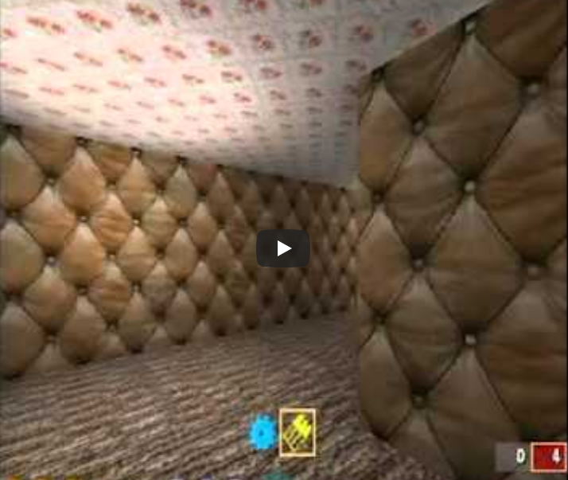](https://www.youtube.com/watch?v=nMR5mjCFZCw)
]

- Deepak Pathak et al. [Curiosity-driven Exploration by Self-supervised Prediction](https://pathak22.github.io/noreward-rl/resources/icml17.pdf), 2017.

- Volodymyr Mnih et al. [Asynchronous Methods for Deep Reinforcement Learning](https://arxiv.org/abs/1602.01783v2), 2016.

]]

---

# Jocs d'estratègia en temps real

.cols5050[
.col1[
.blue[StarCraft 2]: [AlphaStar](https://deepmind.com/blog/article/alphastar-mastering-real-time-strategy-game-starcraft-ii) 

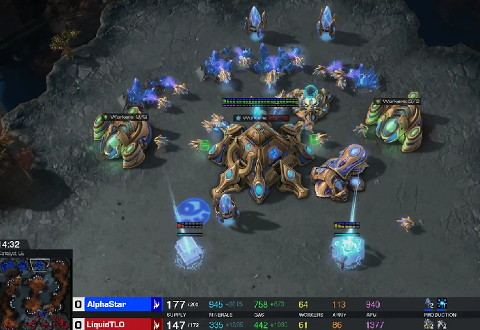

- [Two Minute Paper](https://www.youtube.com/watch?v=jtlrWblOyP4)

- Oriol Vinyals et al. [Grandmaster level in StarCraft II using multi-agent reinforcement learning](https://rdcu.be/bVI7G), 2019.
]
.col2[

.blue[Dota 2]: [OpenAI Five](https://openai.com/five/)

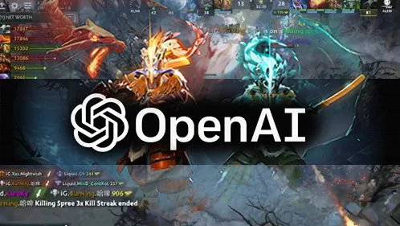

- [Two Minute Paper](https://www.youtube.com/watch?v=tfb6aEUMC04)

- OpenAI. [Dota 2 with Large Scale Deep Reinforcement Learning](https://arxiv.org/abs/1912.06680), 2019.
]]

---
class: left, middle, inverse

# Índex

* .brown[Q-learning]

* .brown[Deep Q-learning]

* .brown[Jocs Seriosos]

* .brown[Fites]

* .cyan[Conducció automàtica]

  - .cyan[Unity]

  - CARLA & BDD100K

---

# Seguiment de la pista

.center[
[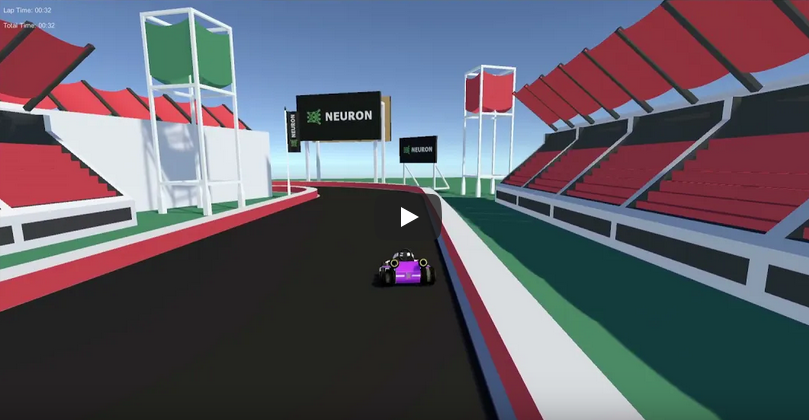](figures/reforc/rlAxel.mkv)
]

| Caract. | Valors |
|---|---|
| Entrada | Sensor de raigs, velocitat del cotxe, distància i direcció al punt de control |
| Recompensa positiva | Arribar al punt de control, moure's cap al punt de control, conduir ràpid |
| Recompensa negativa | Xocar contra la paret, allunyar-se del punt de control |
| Passos d'entrenament | 6 milions |

.footnote[Font: .red[[treball de fi de grau d'Axel Alavedra](https://github.com/AxelAlavedra/TFG_NeuralNetworks)]]

---

# Karting Microgame

.cols5050[
.col1[
.blue[Lidar / RayCast]

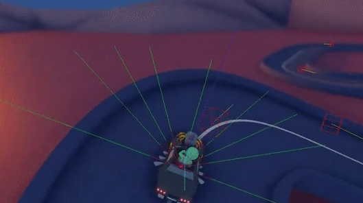
]
.col2[
.blue[Punts de pas]

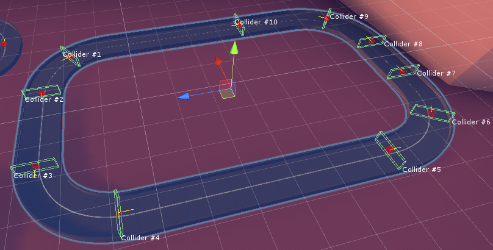
]]

Curs gratuït d'Unity Learn: 

- [Karting Microgame](https://learn.unity.com/project/karting-template?uv=2019.3)

- [NPC's en Karting Game; treball de fi de grau de Haonan Jin](https://upcommons.upc.edu/entities/publication/a01f759a-49f2-418f-a520-b1001a0d4ca8)

---

# Kart autònom amb Unity-ML

.center[
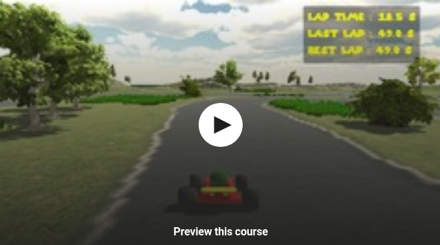]

Curs gratuït d'Udemy: [Self-driving go-kart with Unity-ML](https://www.udemy.com/course/self-driving-go-kart-with-unity-ml/)

.cols5050[
.col1[
- Control PID

- Aprenentatge per imitació (Aprenentatge supervisat en línia)

- Aprenentatge per reforç
]
.col2[
- Vista de càmera com a entrada

- Transferència d'aprenentatge

- ML-Agents
]]

---
class: left, middle, inverse

# Índex

* .brown[Q-learning]

* .brown[Deep Q-learning]

* .brown[Jocs Seriosos]

* .brown[Fites]

* .cyan[Conducció automàtica]

  - .brown[Unity]

  - .cyan[CARLA & BDD100K]

---

# CARLA

[CARLA](http://carla.org/): simulador de codi obert per a la investigació en conducció automàtica

.center[
[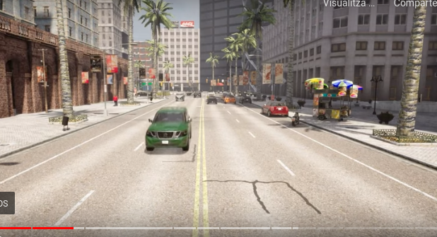](https://www.youtube.com/watch?v=S2VIP0qumas)]

- Alexey Dosovitskiy et al. [CARLA: An Open Urban Driving Simulator](http://proceedings.mlr.press/v78/dosovitskiy17a/dosovitskiy17a.pdf), 2017.

- [Cotxe de Tesla aprenent de simulacions](https://www.youtube.com/watch?v=6hkiTejoyms)

---

# BDD100K

Un conjunt de dades per a l'aprenentatge de les diferents tasques.

.center[
[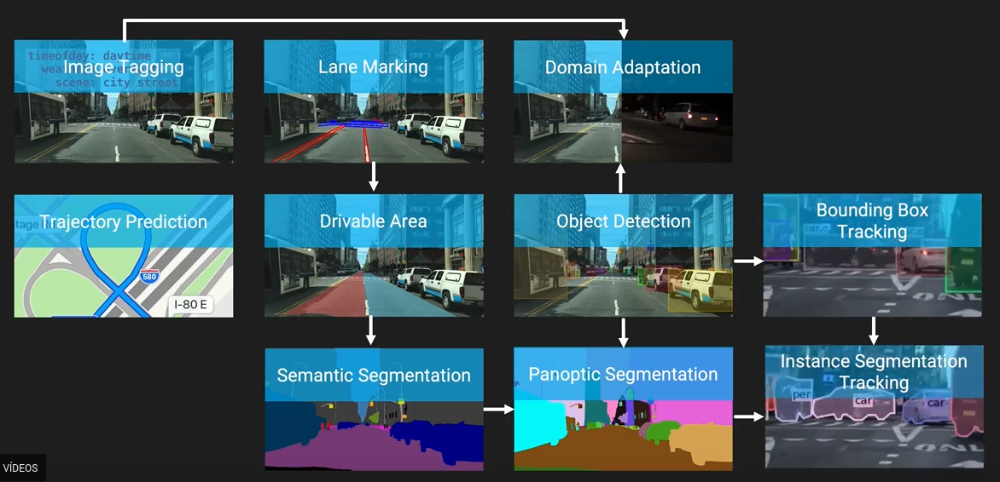](https://www.youtube.com/watch?v=qwQbXrV9X2U&t=299s)]

- [Adreça github](https://github.com/bdd100k/bdd100k)

- Fisher Yu et al., [BDD100K: A Diverse Driving Dataset for Heterogeneous Multitask Learning](https://arxiv.org/abs/1805.04687), 2020.
