class: center, middle

## Intel·ligència Artificial

# Aprenentatge Supervisat


.small[[font](https://www.inverse.com/article/31467-artificial-intelligence-computer-human-game)]

Gerard Escudero, 2026


---
class: left, middle, inverse

# Sumari

- .cyan[Introducció]

- Distàncies

- Probabilitats

- Hiperplans

- Regles

- Teoria de l'aprenentatge

- *Ensembles*

---

# Exemple de dades de classificació

.center[
classe     | longitud <br> sèpal | amplada <br> sèpal | longitud <br> pètal | amplada <br> pètal 
:--------- | -----: | ----: | -----: | ----: 
setosa     | 5.1    | 3.5   | 1.4    | 0.2 
setosa     | 4.9    | 3.0   | 1.4    | 0.2 
versicolor | 6.1    | 2.9   | 4.7    | 1.4 
versicolor | 5.6    | 2.9   | 3.6    | 1.3 
virginica  | 7.6    | 3.0   | 6.6    | 2.1 
virginica  | 4.9    | 2.5   | 4.5    | 1.7 
150 files o exemples (50 per classe).red[*] 
]

* La columna .blue[classe] o .blue[objectiu] normalment s'anomena vector .blue[_Y_] 

* La matriu de la resta de columnes (.blue[atributs] o .blue[característiques]) normalment s'anomena matriu .blue[_X_]

.footnote[.red[*] _Font_ : problema _Iris_ del repositori UCI (Frank & Asunción, 2010)]

---

# Objectiu principal

.large[Construir a partir de dades un .blue[model] capaç de donar una predicció a nous exemples .blue[no vistos].]

.center[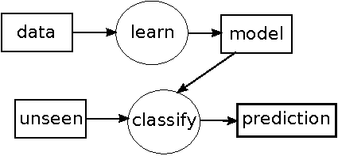]

on:
* _dades = taula anterior_
* _no vist = [4.9, 3.1, 1.5, 0.1]_
* _predicció = "setosa"_

---

# Exemple de dades de regressió

.center[
qualitat | densitat | pH   | sulfats | alcohol
-------- | -------- | ---- | ------- | -------
6        | 0.998    | 3.16 | 0.58    | 9.8
4        | 0.9948   | 3.51 | 0.43    | 11.4
8        | 0.9973   | 3.35 | 0.86    | 12.8
3        | 0.9994   | 3.16 | 0.63    | 8.4
7        | 0.99514  | 3.44 | 0.68    | 10.55
1599 exemples i 12 columnes (11 atributs + 1 objectiu).red[*]
]

La principal diferència entre classificació i regressió són els valors de _Y_ o objectiu:

* .blue[Classificació]: valors discrets o nominals <br>
Exemple: _Iris_, {"setosa", "virginica", "versicolor"}.

* .blue[Regressió]: valors continus o reals <br>
Exemple: _Wine Quality_, valors de 0 a 10.

.footnote[.red[*] _Font_ : problema _Wine Quality_ del repositori UCI (Frank & Asunción, 2010)]
 

---


# Algunes aplicacions

### Classificació

  - Medicina: diagnòstic de malalties

  - Enginyeria: diagnòstic i detecció d'avaries

  - Visió per Computador: reconeixement facial

  - Processament de Llenguatge Natural: filtratge d'spam

### Regressió

  - Medicina: estimació de vida després d'un trasplantament d'òrgan

  - Enginyeria: simulació de processos, predicció

  - Visió per Computador: completament facial

  - Processament de Llenguatge Natural: detecció d'opinions

---
class: left, middle, inverse

# Sumari

- .brown[Introducció]

- .cyan[Distàncies]

  - .cyan[kNN]

  - Centroides

- Probabilitats

- Hiperplans

- Regles

- Teoria de l'aprenentatge

- *Ensembles*

---

# Mètodes basats en distàncies

### Principi d'inducció: .blue[distàncies]

- **euclidiana**:

$$de(v, w) = \sqrt{\sum_{i=1}^n(v_i-w_i)^2}$$

$$n=\text{\#atributs}$$

- **hamming**:

$$dh(v, w) = \frac{\sum_{i=1}^n \delta(v_i, w_i)}{n} $$
$$\delta(a, b)=1\text{, si } a\neq b$$
$$\delta(a, b)=0\text{, si } a = b$$ 

---

# Mètodes basats en distàncies

### Documentació a .blue[sklearn]

.tiny[[https://scikit-learn.org/stable/modules/generated/sklearn.neighbors.DistanceMetric.html](https://scikit-learn.org/stable/modules/generated/sklearn.neighbors.DistanceMetric.html)]

### Alguns algorismes

- *k* veïns més propers (kNN)

- Centroides (o classificador lineal)

---

# Mètodes basats en distàncies

* Com podem donar una predicció als següents exemples?

.center[
| classe | long-sèp | ampl-sèp | long-pèt | ampl-pèt |
|:-------|:---------|:---------|:---------|:---------|
| ??     | 4.9      | 3.1      | 1.5      | 0.1      |
Exemple de classificació no vist a _Iris_]

.center[
| qualitat | densitat | pH   | sulfats | alcohol |
|:---------|:---------|:-----|:--------|:--------|
| ??       | 0.99546  | 3.29 | 0.54    | 10.1    |
Exemple de regressió no vist a _WineQuality_]

* Comencem amb una representació dels problemes...

---

# Exemple de dades de classificació

.center[
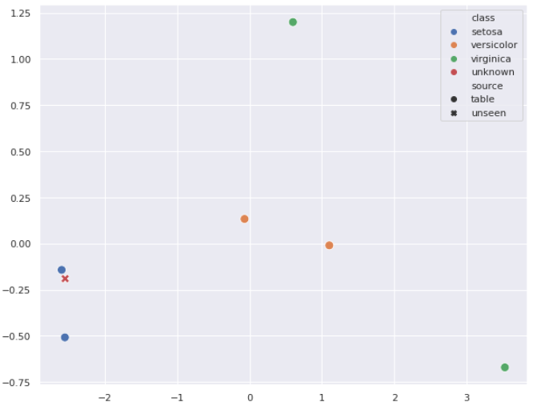
]

---

# Exemple de dades de regressió

.center[
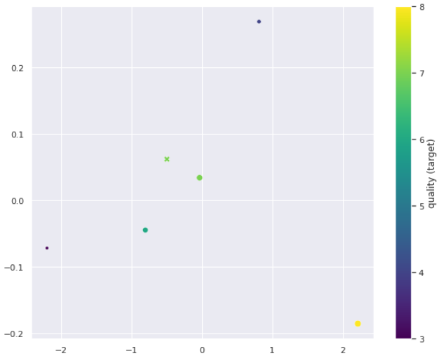
]

---

# Algorisme 1 Veí Més Proper

### Algorisme
* classificació i regressió

$$h(T)=y_i$$

$$i = argmin_i (distancia(X_i,T))$$

### Exemples

* .blue[classificació] exemple (Iris):
  - distàncies: [0.47, 0.17, 3.66, 2.53, 6.11, 3.45]
  - predicció = setosa (0.17)

* .blue[regressió] exemple (Wine Quality):
  - distàncies: [0.33, 1.32, 2.72, 1.71, 0.49] 
  - predicció = 6 (0.33)

---

# Algorisme *k* veïns més propers (kNN)

### Algorisme 

1. construir el conjunt $S$ de $k$ $y_i$'s amb distància mínima a l'exemple no vist $T$ (com a 1NN)

2. predicció:

$$h(T)=moda(S)\text{, si classificació}$$

$$h(T)=mitjana(S)\text{, si regressió}$$

### Exemples

- .blue[classificació]: Iris i distància euclidiana

$$h(T)=moda({setosa, setosa, versicolor})=setosa$$

- .blue[regressió]: Wine Quality i distància euclidiana

$$h(T)=mitjana({6,4,7})=5.7$$


---

# Alguns problemes

- el valor *k* sol ser nombre *senar* o *primer* per evitar .blue[empats]

- una modificació habitual de l'algorisme és .blue[ponderar] els punts per la inversa de la seva distància en les funcions moda o mitjana

- .blue[aprenentatge mandrós] (_lazy_): no fa res en l'etapa d'aprenentatge; calcula tot en l'etapa de classificació 

  - Això pot produir alguns problemes en aplicacions en temps real

  - Això fa de *k*NN un dels algorismes més útils per a la imputació de valors absents

- .blue[característiques nominals]

  - canviant la distància (p.ex.: *hamming*)

  - codificant-les com a numèriques (per veure en el laboratori)


---

# sklearn

#### .blue[Classificació]:

```python3
from sklearn.neighbors import KNeighborsClassifier
KNeighborsClassifier(3)
```

#### .blue[Regressió]:

```python3
from sklearn.neighbors import KNeighborsRegressor
KNeighborsRegressor(1)
```

#### Paràmetres habituals:

```python3
KNeighborsClassifier(k, weights='distance')
# per vots majoritaris ponderats o mitjana
```

#### Guia d'usuari: 

.tiny[[https://scikit-learn.org/stable/modules/neighbors.html](https://scikit-learn.org/stable/modules/neighbors.html)]

---
class: left, middle, inverse

# Sumari

- .brown[Introducció]

- .cyan[Distàncies]

  - .brown[kNN]

  - .cyan[Centroides]

- Probabilitats

- Hiperplans

- Regles

- Teoria de l'aprenentatge

- *Ensembles*

---

# Exemple de dades de classificació

.center[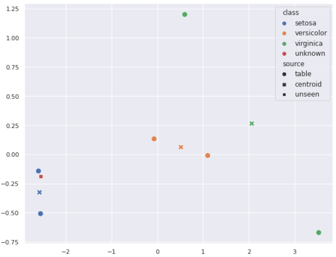]

---

# Algorisme Centroides

#### .blue[Aprendre]: model=centroides (mitjana de columnes per cada classe)

#### Exemple: Iris 

| centroides | long-sèp | ampl-sèp | long-pèt | ampl-pèt |
|------------|---|---|---|---|
| setosa | 5.0 | 3.25 | 1.4 | 0.2 |
| versicolor | 5.85 | 2.9 | 4.15 | 1.35 |
| virginica | 6.25 | 2.75 | 5.55 | 1.9 |

#### .blue[Classificar]: aplicar 1NN amb centroides com a dades 

#### Exemple: Iris i distància euclidiana 

$$distancies = (0.23, 3.09, 4.65)$$

$$predicció=setosa (0.23)$$

---

# sklearn

#### .blue[Classificació]:

```python3
from sklearn.neighbors import NearestCentroid
NearestCentroid()
```

#### No té paràmetres

#### Guia d'usuari: 

.tiny[[https://scikit-learn.org/stable/modules/neighbors.html#nearest-centroid-classifier](https://scikit-learn.org/stable/modules/neighbors.html#nearest-centroid-classifier)]

---
class: left, middle, inverse

# Sumari

- .brown[Introducció]

- .brown[Distàncies]

- .cyan[Probabilitats]

- Hiperplans

- Regles

- Teoria de l'aprenentatge

- *Ensembles*

---

# Mètodes basats en probabilitats

- Principi d'inducció: .blue[probabilitats]

| class      | cap-shape | cap-color | gill-size | gill-color |
|:-----------|:----------|:----------|:----------|:-----------|
| poisonous  | convex    | brown     | narrow    | black      |
| edible     | convex    | yellow    | broad     | black      |
| edible     | bell      | white     | broad     | brown      |
| poisonous  | convex    | white     | narrow    | brown      |
| edible     | convex    | yellow    | broad     | brown      |
| edible     | bell      | white     | broad     | brown      |
| poisonous  | convex    | white     | narrow    | pink       |
.center[fins a 8 124 exemples i 22 atributs .red[*]]

- Què val .blue[$P(poisonous)$]?

.footnote[.red[*]  _Font_ : problema _Mushroom_ del repositori UCI (Frank & Asunción, 2010)]

---

# Mètodes basats en probabilitats

- En la majoria de casos l'estimem a partir de dades (.blue[estimació de màxima versemblança])

$$P(poisonous)=\frac{N(poisonous)}{N}=\frac{3}{7}\approx 0.429$$

- Com podem donar una predicció a partir de probabilitats al següent exemple? 

| class | cap-shape | cap-color | gill-size | gill-color |
|:------|:----------|:----------|:----------|:-----------|
| ??    | convex    | brown     | narrow    | black      |

- Alguns algorismes:

  - Naïve Bayes

  - LDA (Anàlisi Discriminant Lineal) <br>
.tiny[[https://scikit-learn.org/stable/modules/lda_qda.html](https://scikit-learn.org/stable/modules/lda_qda.html)]

  - Regressió logística <br>
.tiny[[https://scikit-learn.org/stable/modules/linear_model.html#logistic-regression](https://scikit-learn.org/stable/modules/linear_model.html#logistic-regression)]

---

# Naïve Bayes

#### .blue[Model d'Aprenentatge]

$$\text{model}=[P(y)\simeq\frac{N(y)}{N},P(x_i|y)\simeq\frac{N(x_i|y)}{N(y)};\forall y \forall x_i]$$

.col5050[
.col1[
| $y$       | $P(y)$ |
|:----------|-------:|
| poisonous | 0.429  |
| edible    | 0.571  |
]
.col2[
| attr:valor       | poisonous | edible |
|:-----------------|----------:|-------:|
| cap-shape:convex | 1         | 0.5    |
| cap-shape:bell   | 0         | 0.5    |
| cap-color:brown  | 0.33      | 0      |
| cap-color:yellow | 0         | 0.5    |
| cap-color:white  | 0.67      | 0.5    |
| gill-size:narrow | 1         | 0      |
| gill-size:broad  | 0         | 1      |
| gill-color:black | 0.33      | 0.25   |
| gill-color:brown | 0.33      | 0.75   |
| gill-color:pink  | 0.33      | 0      |
]
]

---

# Naïve Bayes

#### .blue[Classificació]

$$h(T) \approx argmax_y P(y)\cdot P(t_1|y)\cdot\ldots\cdot P(t_n|y)$$

- Exemple de prova $T$:

| class | cap-shape | cap-color | gill-size | gill-color |
|:------|:----------|:----------|:----------|:-----------|
| ??    | convex    | brown     | narrow    | black      |

- Números:
$$P(poisonous|T) = 0.429 \cdot 1 \cdot 0.33 \cdot 1 \cdot 0.33 = 0.047$$
$$P(edible|T) = 0.571 \cdot 0.5 \cdot 0 \cdot 0 \cdot 0.25 = 0$$
- Predicció: $$h(T) = poisonous$$

---

# Naïve Bayes

#### .blue[Notes]:

- Necessita una tècnica de suavitzat per evitar comptatges zero <br>
  - Exemple: Laplace
$$P(x_i|y)\approx\frac{N(x_i|y)+1}{N(y)+N}$$

- Assumeix independència condicional entre cada parell de característiques

- És empíricament un classificador decent però un mal estimador
  - Això significa que $P(y|T)$ no és una bona probabilitat 

---

# Naïve Bayes Gaussià

#### Què passa amb les característiques numèriques?

.blue[Naïve Bayes Gaussià] és una implementació assumint distribució gaussiana:

$$P(x_i|y)=\frac{1}{\sqrt{2\pi\sigma_y^2}}\exp\left(-\frac{(x_i-\mu_y)^2}{2\sigma_y^2}\right)$$

* Exemple:

.cols5050[
.col1[
| Frena? | Distància | Velocitat |
|-------:|----------:|----------:|
| S      | 2.4       | 11.3      |
| S      | 3.2       | 70.2      |
| N      | 75.7      | 72.7      |
| N      | 2.8       | 15.2      |
| %?     | 79.2      | 12.1      |
.center[Font: (Millington, 2019)]
]
.col2[
$$\mu_y=\frac{\sum_i x_i^y}{n_y}$$
$$\sigma_y^2=\frac{\sum_i (x_1^y - \mu_y)^2}{n_y}$$
]]

---

# Naïve Bayes Gaussià II

.col5050[
.col1[
**Model d'aprenentatge:**

| $y$  | $P(y)$ |
|:-----|-------:|
| S    | 0.5    |
| N    | 0.5    |

<br>

|                 | Distància | Velocitat |
|:----------------|----------:|----------:|
| $\mu_S$         | 2.8       | 40.75     |
| $\mu_N$         | 39.25     | 43.95     |
| $\sigma_S^2$    | 0.32      | 1734.605  |
| $\sigma_N^2$    | 2657.205  | 1653.125  |
]
.col2[
**Classificació:**

$$P(S|T)=0.5\cdot 0.0\cdot 0.00756 = 0.0$$

$$P(N|T)=0.5\cdot 0.00573\cdot 0.00722 = 0.00002$$

$$h(T)=N$$

**Nota:**

$$P(velocitat=12.1|S)=\frac{1}{\sqrt{2\cdot\pi\cdot 1734.605}}\cdot$$

$$\cdot \exp\left(-\frac{(12.1-40.75)^2}{2\cdot 1734.605}\right)=0.00669$$
]]

---

# sklearn

#### .blue[Classificació]:

```python3
from sklearn.naive_bayes import GaussianNB
GaussianNB()
```

#### No té .blue[paràmetres]

#### .blue[Guia d'usuari]: 

.tiny[[https://scikit-learn.org/stable/modules/naive_bayes.html](https://scikit-learn.org/stable/modules/naive_bayes.html)]

---
class: left, middle, inverse

# Sumari

- .brown[Introducció]

- .brown[Distàncies]

- .brown[Probabilitats]

- .cyan[Hiperplans]

  - .cyan[Kernels]

  - *SVMs*

- Regles

- Teoria de l'aprenentatge

- *Ensembles*

---

# Centroides

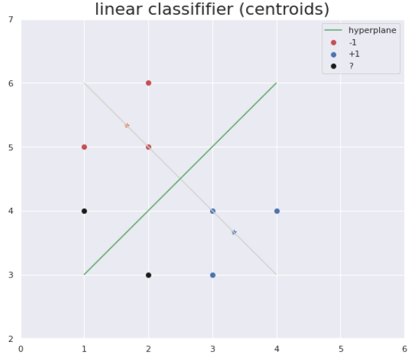

---

# Classificador Lineal

.cols5050[
.col1[

#### Donat: 
$P$: centroide positiu <br>
$N$: centroide negatiu <br>
$\langle,\rangle$: producte escalar 

#### Fórmules:

$h(T)=sign\left(\langle W,T\rangle+b\right)$

on:

$W=P-N$ 

$b=\frac{1}{2}(\langle P,P\rangle-\langle N,N\rangle)$

**Implementació**: [html](codis/cl.html) 
]
.col2[

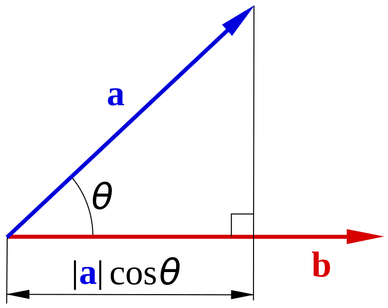
.center[.tiny[[https://sv.wikipedia.org/wiki/Fil:Scalar-product-dot-product.svg](https://sv.wikipedia.org/wiki/Fil:Scalar-product-dot-product.svg)]]


]]

---

# Separabilitat Lineal

El següent conjunt de dades .blue[és linealment no separable]

.center[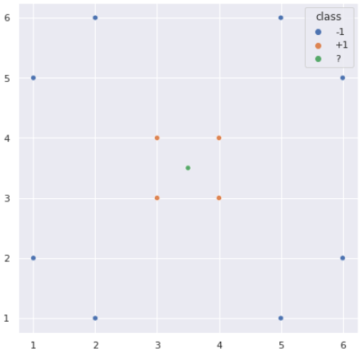]
 
Els .blue[Kernels] tracten de convertir conjunts de dades a linealment separables mitjançant projeccions

---

# Kernels

Donada una funció de projecció $\phi(X)$ tal que.red[*]:

.center[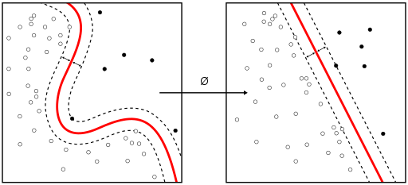]

un .blue[kernel] serà:

$$\kappa(X,Z)=\langle\phi(X),\phi(Z)\rangle$$

.footnote[.red[*] .red[font]: [https://en.wikipedia.org/wiki/File:Kernel_Machine.svg](https://en.wikipedia.org/wiki/File:Kernel_Machine.svg)]


---

# Kernels

Matriu kernel:

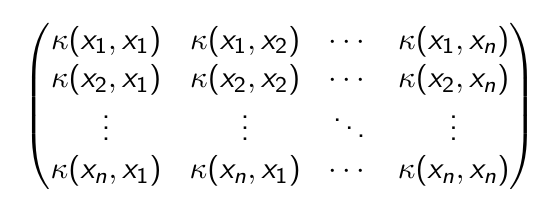

Kernels habituals.red[*]

- .blue[lineal]: $\langle X,Z\rangle$

- .blue[polinòmic]: $(\gamma\langle X,Z\rangle+r)^d$

- .blue[rbf] (funció de base radial): $\exp(-\gamma\Vert X-Z\Vert^2)$

.footnote[.red[*] a sklearn: [https://scikit-learn.org/stable/modules/svm.html#svm-kernels](https://scikit-learn.org/stable/modules/svm.html#svm-kernels)]


---

# Centroides Kernel

Funció de predicció: 

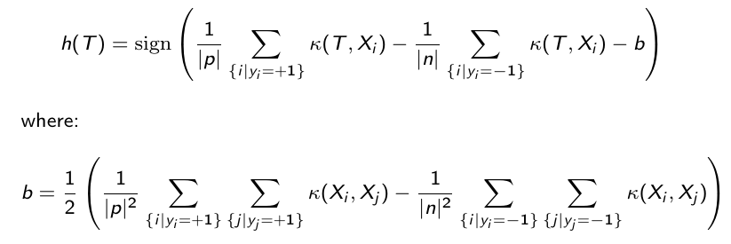

<!---
$$h(T)=\sign\left(\frac{1}{\vert p\vert}\sum_{\lbrace i\vert y_i=+1\rbrace}\kappa(T,X_i) - \frac{1}{\vert n\vert}\sum_{\lbrace i\vert y_i=-1\rbrace}\kappa(T,X_i) -b \right)$$
-->

**Implementació**: [html](codis/kernels.html)

---

# Representació Gràfica

Representació usant PCA i kPCA amb kernel rbf: 


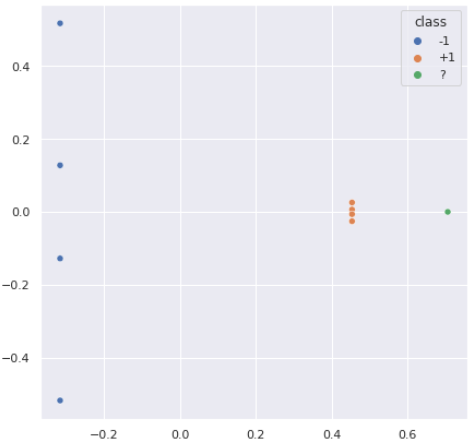

---

# Algunes aplicacions

- Els kernels s'han aplicat a molts algorismes:

  - Centroides

  - PCA

  - k-means

  - SVMs

- Els kernels es poden adaptar al problema com una altra manera de representar dades

  - Hi ha molts kernels per a dades estructurades: arbres, grafs, conjunts... <br>
Exemple: kernel per a conjunts

$$\kappa(X,Z)=2^{\vert X\cap Z\vert}$$

---
class: left, middle, inverse

# Sumari

- .brown[Introducció]

- .brown[Distàncies]

- .brown[Probabilitats]

- .cyan[Hiperplans]

  - .brown[Kernels]

  - .cyan[*SVMs*]

- Regles

- Teoria de l'aprenentatge

- *Ensembles*


---

# Màquines de Vectors de Suport (SVMs)

#### Quins són els millors .blue[hiperplans]?
 
.center[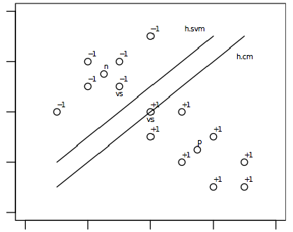]

Aquells que maximitzen el .blue[marge].

---

# Vectors de Suport

#### Què són els .blue[vectors de suport]?

.center[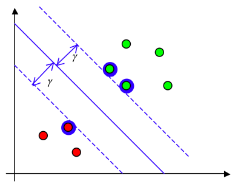]

Els més propers al marge.

---

# Classificació

#### Funcions de predicció:

- Lineal:

$$h(T)=\langle W,T\rangle + b = b + \sum_{\lbrace i\vert X_i\in SVs\rbrace} y_i \alpha_i \langle X_i,T\rangle$$

- Kernel general:

$$h(T)=\langle W,\phi(T)\rangle + b = b + \sum_{\lbrace i\vert X_i\in SVs\rbrace} y_i \alpha_i \kappa(X_i,T)$$

---

# Marge suau 

#### Les SVM permeten alguns errors als hiperplans: 

.center[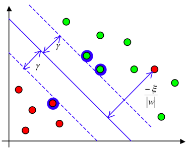]

Això s'anomena .blue[marge suau (*soft*)].

---

# Kernels a les SVMs

- Les SVMs suporten kernels.red[*]:

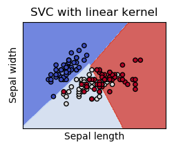
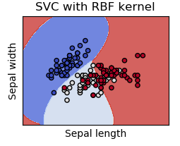

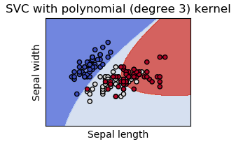

- També suporten .blue[kernels personalitzats].

.footnote[.red[*] .red[Font]: [https://scikit-learn.org/stable/modules/svm.html#svm-classification](https://scikit-learn.org/stable/modules/svm.html#svm-classification)]

---

# Regressió de Vectors de Suport

- Quin és el model per a .blue[regressió]? 

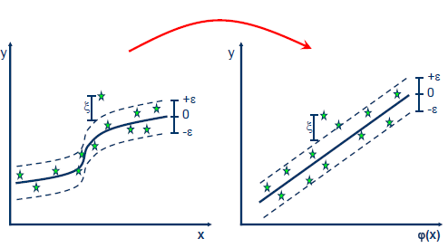

- Té un paràmetre addicional: el tub $\varepsilon$

.footnote[.red[*] .red[Font]: [https://www.saedsayad.com/support_vector_machine_reg.htm](https://www.saedsayad.com/support_vector_machine_reg.htm)]

---

# sklearn

.cols5050[
.col1[
#### .blue[Classificació]: 

```Python3
from sklearn.svm import SVC
SVC()
```
]

.col2[
#### .blue[Regressió]: 

```Python3
from sklearn.svm import SVR
SVR()
```
]]

#### .blue[Paràmetres]:

```Python3
kernel = 'linear', 'poly', 'rbf', 'precomputed'...
degree = 2, 3...
gamma = 'scale', 1, 0.1, 10...
C = 1, 10, 0.1  # penalització del marge suau
epsilon = 0.1
max_iter = -1, 1000...
```

#### .blue[Guia d'usuari]: <br>
[https://scikit-learn.org/stable/modules/svm.html#svm-classification](https://scikit-learn.org/stable/modules/svm.html#svm-classification)

---
class: left, middle, inverse

# Sumari

- .brown[Introducció]

- .brown[Distàncies]

- .brown[Probabilitats]

- .brown[Hiperplans]

- .cyan[Regles]

- Teoria de l'aprenentatge

- *Ensembles*

---

# Mètodes basats en regles

-  Principi d'inducció: .blue[regles]

| class | cap-shape | cap-color | gill-color |
|-------|-----------|-----------|------------|
| poisonous | convex | brown | black |
| edible | convex | yellow | black |
| edible | bell | white | brown |
| poisonous | convex | white | brown |
| edible | convex | yellow | brown |
| edible | bell | white | brown |
| poisonous | convex | white | pink |
.center[fins a 8124 exemples i 22 atributs.red[*]]

- Quines regles es poden extreure de les dades? 

.blue[$$\text{gill-color}=\text{pink}\Longrightarrow\text{poisonous}$$]

.footnote[.red[*] .red[Font]: problema *Mushroom* del Repositori UCI (Frank & Asunción, 2010)]

---

# Arbres de Decisió

.blue[Arbre resultant]:

.center[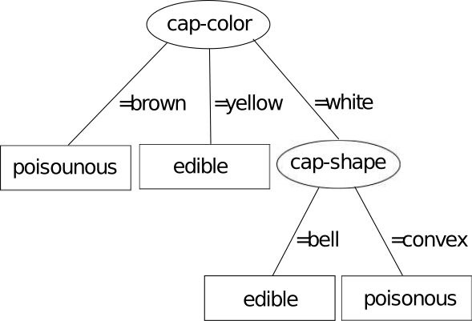]

.blue[Classificació]: explorant l'arbre usant la prova

| class | cap-shape | cap-color | gill-color |
|---|---|---|---|
| ?? | convex | brown | black |

.center[.blue[predicció: poisonous]]

---

# Aprenentatge d'Arbres de Decisió

.blue[Aprendre]: 

construir un arbre dividint recursivament per un dels atributs amb més bondat

#### Exemple:

.blue[Pas 1]: cada atribut és avaluat.red[*]

$$\text{cap-shape}=\frac{3+2}{7}=0.71$$
$$\text{cap-color}=\frac{1+2+2}{7}=0.71$$
$$\text{gill-color}=\frac{1+3+1}{7}=0.71$$

.footnote[.red[*] el nombre d'exemples de la moda s'assigna a cada numerador]

---

# Aprenentatge d'Arbres de Decisió

.blue[Pas 2]: un dels millors atributs es selecciona com a node de l'arbre: 

$$\text{cap-color}$$

.blue[Pas 3]: per cada valor amb només una classe es crea una fulla: 

$$\text{brown} \Longrightarrow \text{poisonous}$$

$$\text{yellow} \Longrightarrow \text{edible}$$

.blue[Pas 4]: es construeix un nou conjunt per la resta de valors

.center[exemples _white_ sense _cap-color_]

| class | cap-shape | gill-color |
|---|---|---|
| edible | bell | brown |
| poisonous | convex | brown |
| edible | bell | brown |
| poisonous | convex | pink |

---

# Aprenentatge d'Arbres de Decisió

.blue[Pas 5]: l'algorisme es reinicia amb el conjunt anterior: 

$$\text{cap-shape}=\frac{2+2}{4}=1$$

$$\text{gill-color}=\frac{2+1}{4}=0.75$$

.blue[Pas 6]: l'algorisme acaba quan no queden atributs o s'aconsegueix cobertura completa

---

# Punts de Tall

- Què passa amb els .blue[atributs numèrics]?

| classe | longitud | amplada |
|---|---|---|
| versicolor | 6.1 | 2.9 |
| versicolor | 5.6 | 2.9 |
| virginica | 7.6 | 3.0 |
| virginica | 4.9 | 2.5 |

- .blue[Punts de tall] per l'atribut _amplada_

| classe | amplada | punts de tall | precisió |
|---|---:|---:|---|
| virginica | 2.5 | | |
| versicolor | 2.9 | 2.7 | $\frac{1+2}{4}=0.75$ |
| versicolor | 2.9 | | |
| virginica | 3.0 | 2.95 | $\frac{2+1}{4}=0.75$ |

---

# Punts de Tall

#### .blue[Arbre] resultant:

.center[]

---

# ID3

#### .blue[ID3]: variant d'arbre de decisió
 
L'entropia és una mesura de la quantitat d'incertesa en les dades:

$$H(S)=-\sum_{y\in Y}p(y)log_2(p(y))$$

El guany d'informació és una mesura de la diferència d'entropia abans i després de la divisió:

.center[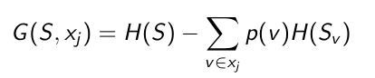]

<!---
$$G(S,x_j)=H(S)-\sum_{v\in x_j}p(v)H(S_v)$$
-->

---

# CART

#### .blue[CART]: una altra variant d'arbre de decisió

- La impuresa de Gini és una mesura de com sovint un element escollit aleatòriament del conjunt seria etiquetat incorrectament 

$$IG(p)=1-\sum_{y\in Y}p_y^2$$

.center[S'usa en lloc de l'entropia]

- característiques nominals i numèriques

- classificació i regressió


- Exemple:

.center[.tiny[[https://sefiks.com/2018/08/27/a-step-by-step-cart-decision-tree-example/](https://sefiks.com/2018/08/27/a-step-by-step-cart-decision-tree-example/)]]

.center[També conté un exemple de regressió]

---

# Alguns Problemes

Els models semblen.red[*]:

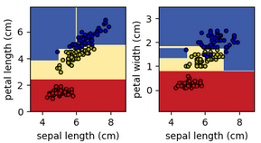
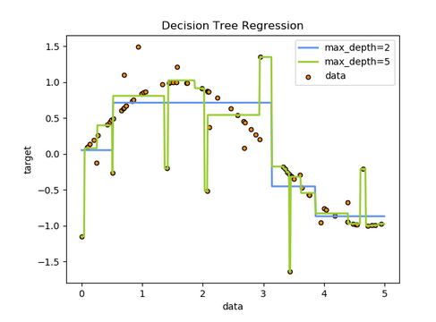

- Les regles resultants són molt comprensibles per humans

- La normalització no afecta els arbres

- Arbres complexos i grans tendeixen al sobreajustament (*overfitting*: no generalitzen molt bé)

- Petits canvis en les dades poden produir arbres molt diferents

.footnote[.red[*] .red[Font]: [https://scikit-learn.org/stable/modules/tree.html](https://scikit-learn.org/stable/modules/tree.html)]

---

# sklearn

#### .blue[Classificació]:

```Python3
from sklearn.tree import DecisionTreeClassifier 
DecisionTreeClassifier()
```

#### .blue[Regressió]:

```Python3
from sklearn.tree import DecisionTreeRegressor
DecisionTreeRegressor()
```

#### .blue[Paràmetres]:

```Python3
criterion = 'entropy' or 'gini'
max_depth = int or None
```

#### .blue[Guia d'usuari]:

.tiny[[https://scikit-learn.org/stable/modules/tree.html](https://scikit-learn.org/stable/modules/tree.html)] 

---
class: left, middle, inverse

# Sumari

- .brown[Introducció]

- .brown[Distàncies]

- .brown[Probabilitats]

- .brown[Hiperplans]

- .brown[Regles]

- .cyan[Teoria de l'aprenentatge]

- *Ensembles*

---

# Exemple de biaix i variància

- si 11 punts vermells són el conjunt de dades disponible:

.center[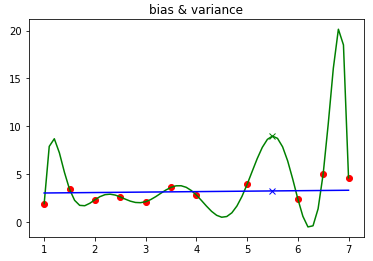]

- es pot aproximar mitjançant:
  - un polinomi de grau 10: $R^2=1.0$
  - una línia recta: $R^2=0.122$

- Què passa amb 5.5?

---

# Biaix i variància

.cols5050[
.col1[
.center[
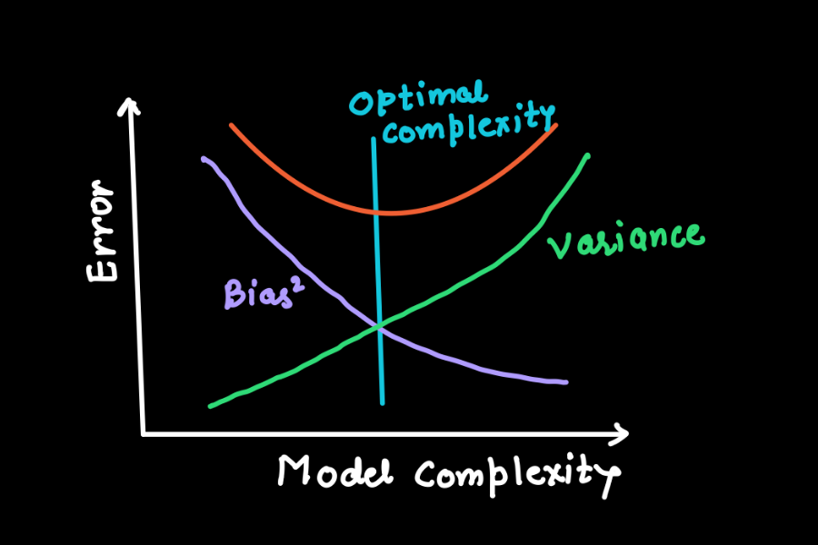

[font](https://medium.com/@pyrootml/difference-between-bias-and-variance-9093ac48acd4)
]
]
.col2[
Components de l'error (.red[[referència](https://towardsdatascience.com/regularization-the-path-to-bias-variance-trade-off-b7a7088b4577)]):

- .blue[$biaix^2$]: "quant difereixen els valors predits dels valors reals".

- .blue[$variància$]: "com varien les prediccions fetes sobre el mateix valor en diferents realitzacions del model".

- $Error$ $irreductible$.
]]

---

# *Underfitting* i *overfitting*

.center[
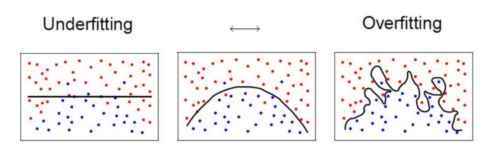 <br>
.red[[font](https://tomrobertshaw.net/2015/12/introduction-to-machine-learning-with-naive-bayes/)]
]

|   | Underfitting | Overfitting |
|---|---|---|
| símptomes | error d'entrenament massa alt | error de test alt |
| causes | model massa simple <br> no prou entrenament | model massa complex <br> massa entrenament <br> conjunt d'entrenament massa petit |
| solucions | augmentar complexitat del model <br> entrenar més temps | reduir complexitat del model <br> aturar entrenament (aturada primerenca) <br> obtenir més dades d'entrenament / augment de dades |
| error relacionat | biaix | variància |

---

# Regles d'or de l'aprenentatge

- .blue[Navalla d'Occam a l'aprenentatge]: <br><br>
els models més simples tenen més probabilitats de ser correctes que els complexos

- .blue[*No free lunch theorem*]: <br><br>
no hi ha cap mètode que superi tots els altres per a tots els conjunts de dades

- .blue[Maledicció de la dimensionalitat]: <br><br>
quan la dimensionalitat augmenta, la quantitat de dades necessàries per donar suport al resultat sovint creix exponencialment

---
class: left, middle, inverse

# Sumari

- .brown[Introducció]

- .brown[Distàncies]

- .brown[Probabilitats]

- .brown[Hiperplans]

- .brown[Regles]

- .brown[Teoria de l'aprenentatge]

- .cyan[*Ensembles*]

---

# *Ensembles*

- *Ensembles*: combinació de classificadors per millorar la generalització

- Meta-aprenentatge

- Dues grans famílies:

  - .blue[Mitjana]: <br> mitjana de prediccions <br> millora reduint la variància <br> _Bagging_ i _Random Forest_

  - .blue[Boosting]: <br> èmfasi incremental en els errors <br> millora reduint el biaix <br> _AdaBoost_ i _Gradient Boosting_

- Qualsevol algorisme estimador base, però els més usats són els .blue[Arbres de Decisió]

- Guia d'usuari: <br>
[https://scikit-learn.org/stable/modules/ensemble.html](https://scikit-learn.org/stable/modules/ensemble.html)

---

# *Bagging*

#### .blue[Algorisme]:

- Col·lecció de conjunts seleccionant aleatòriament amb reemplaçament de les dades originals

- Es construeix un estimador per a cadascun dels conjunts anteriors

- Predicció mitjançant la mitjana d'aquells estimadors anteriors

#### .blue[sklearn]:

```Python3
from sklearn.ensemble import BaggingClassifier
from sklearn.neighbors import KNeighborsClassifier
BaggingClassifier(KNeighborsClassifier())
...
# De manera similar amb BaggingRegressor
```

#### .blue[Guia d'usuari]: <br>
.tiny[[https://scikit-learn.org/stable/modules/ensemble.html#bagging](https://scikit-learn.org/stable/modules/ensemble.html#bagging)]

---

# *Random Forests*

És una variant de _bagging_ amb _arbres de decisió_ com a estimador base <br>

Els nodes dels arbres de decisió se seleccionen entre una selecció aleatòria d'atributs

#### .blue[sklearn]

```Python3
from sklearn.ensemble import RandomForestClassifier
RandomForestClassifier(n_estimators=10)
...
# De manera similar amb RandomForestRegressor
```

#### .blue[Guia d'usuari]: <br>
[https://scikit-learn.org/stable/modules/ensemble.html#forest](https://scikit-learn.org/stable/modules/ensemble.html#forest)

---

# AdaBoost

#### .blue[Aprenentatge].red[*]:

- Aprèn un classificador feble a cada iteració 

- A cada iteració augmenta el pes dels exemples errònis i disminueix el dels correctes

.center[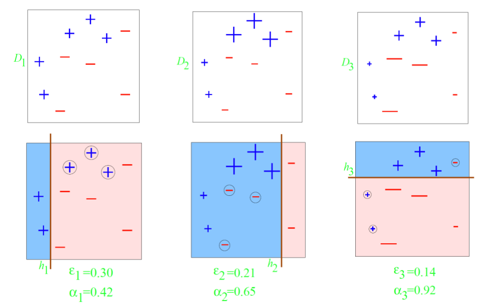]

.footnote[.red[*] .red[Font]: [https://www.cs.cmu.edu/~aarti/Class/10701/slides/Lecture10.pdf](https://www.cs.cmu.edu/~aarti/Class/10701/slides/Lecture10.pdf)]

---

# AdaBoost

#### .blue[Classificació].red[*]:

$$H(X)=sign\left(\sum_{t=1}^T\alpha_th(X)\right)$$

.center[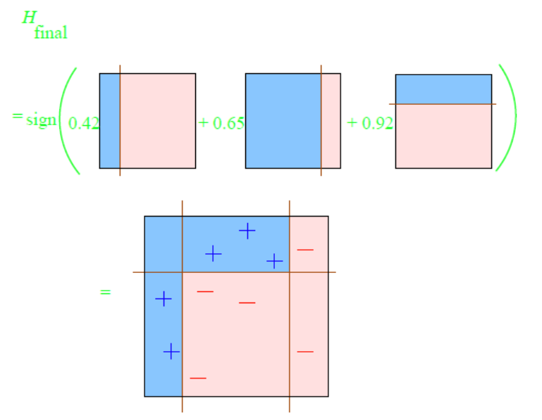]

.footnote[.red[*] .red[Font]: [https://www.cs.cmu.edu/~aarti/Class/10701/slides/Lecture10.pdf](https://www.cs.cmu.edu/~aarti/Class/10701/slides/Lecture10.pdf)]

---

# AdaBoost

#### .blue[sklearn]

```Python3
from sklearn.ensemble import AdaBoostClassifier
AdaBoostClassifier()
...
# De manera similar amb AdaBoostRegressor
```

.blue[Paràmetres]:

```Python3
n_estimators=10
```

.blue[Guia d'usuari]: <br>
[https://scikit-learn.org/stable/modules/ensemble.html#adaboost](https://scikit-learn.org/stable/modules/ensemble.html#adaboost) 

---

# Gradient Boosting

Generalització del boosting optimitzant (descens del gradient) *Loss*

#### .blue[sklearn]:

```Python3
from sklearn.ensemble import GradientBoostingClassifier
GradientBoostingClassifier()
...
# De manera similar amb GradientBoostingRegressor
```

.blue[Paràmetres]:

```Python3
n_estimators=10
max_depth=1
```

.blue[Guia d'usuari]: <br>
[https://scikit-learn.org/stable/modules/ensemble.html#gradient-boosting](https://scikit-learn.org/stable/modules/ensemble.html#gradient-boosting)

XGBoost: una altra implementació <br>
[https://pandas-ml.readthedocs.io/en/latest/xgboost.html](https://pandas-ml.readthedocs.io/en/latest/xgboost.html)

