class: center, middle

## Intel·ligència Artificial

# Validació de models i <br> ML en producció

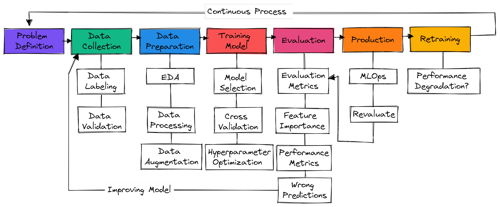<br>
.small[[font](https://www.datacamp.com/blog/machine-learning-projects-for-all-levels)]

Gerard Escudero i Bardia Rafieian, 2026


---
class: left, middle, inverse

# Índex

- .cyan[Validació de models]

  - .cyan[Validació]

  - .cyan[Comparació d'algorismes]

  - Mesures d'avaluació

  - Referències

- ML en producció

---

# Protocols de validació

Dividir el conjunt de dades per estimar un rendiment de generalització no esbiaixat

- .blue[Validació simple]: divisió en entrenament i test (p. ex.: 70%-30%) després de barrejar els exemples
  - .brown[*sampling bias*]: error degut al conjunt seleccionat

  - .brown[*resampling*]: fer repeticions (proporcionar $\mu$ i $stdev$)

  - llindar o `sklearn.model_selection.train_test_split`

.cols5050[
.col1[
- .blue[Validació creuada k-fold] <br>
(proporcionar també $\mu$ i $stdev$)
  - .brown[redueix el *sampling bias*]

  - .brown[*Leave one out*] <br>
$k=nombre\ de\ mostres$

  - `sklearn.model_selection.KFold`

]

.col2[
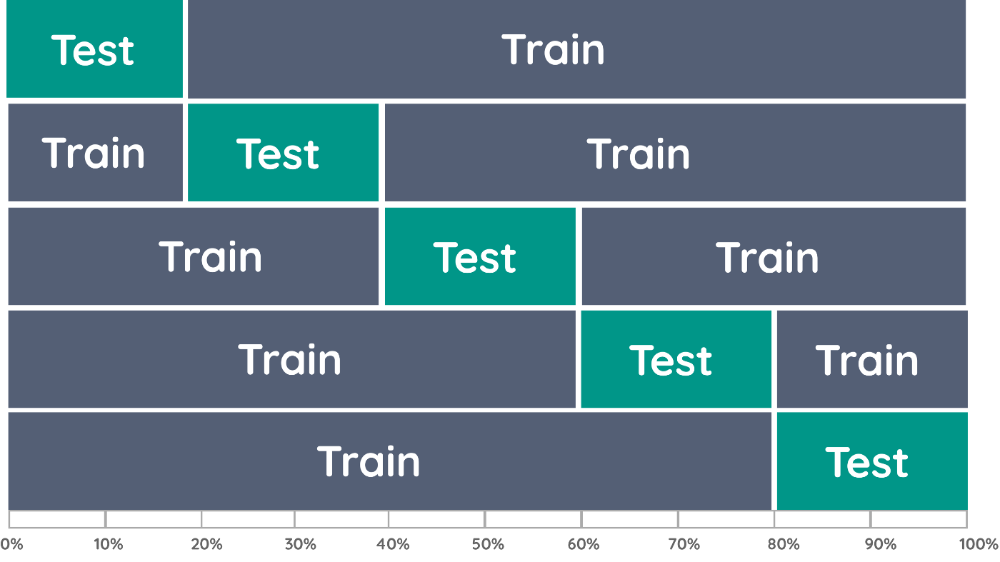

.tiny[.red[[Font](https://towardsdatascience.com/validating-your-machine-learning-model-25b4c8643fb7)]]

]]

---

# Comparació d'algorismes

La diferència és estadísticament significativa?

- Validació simple $\rightarrow$ test de McNemar ([exemple](codis/mcnemar.html))

- Validació creuada $\rightarrow$ test t aparellat 5x2CV (Student) ([exemple](codis/student.html))

#### Com?

- mòdul `mlxtend`

- resultat: p-valor

- p valor < 0.05: rebutjar hipòtesi nul·la $\rightarrow$ diferència significativa

---
class: left, middle, inverse

# Índex

- .cyan[Validació de models]

  - .brown[Validació]

  - .brown[Comparació d'algorismes]

  - .cyan[Mesures d'avaluació]

  - .cyan[Referències]

- ML en producció

---

# Mesures d'avaluació

```Python3
from sklearn.metrics import ??
```

### Classificació

- .blue[Precisió]: <br>
més comú <br>
`accuracy_score`

- .blue[Matriu de confusió] <br>
rendiment complet d'etiquetes <br>
`confusion_matrix`

- .blue[Log loss] <br>
error (1-precisió) que penalitza les classificacions errònies <br>
`log_loss`

- .blue[Mesures F]: <br>
per a conjunts de dades molt desequilibrats <br>
èmfasi en classes positives i errors <br>
`f1_score`

---

# Mesures d'avaluació

### Classificació

.cols5050[
.col1[
- .blue[Corba ROC i AUC]: <br>
estàndard en medicina <br>
[exemple i ús](https://scikit-learn.org/stable/modules/model_evaluation.html#roc-metrics) <br>
`roc_auc_score`

### Regressió

- .blue[$R^2$]: <br>
`r2_score`

- .blue[Error Quadràtic Mitjà]: <br>
`mean_squared_error`
]
.col2[
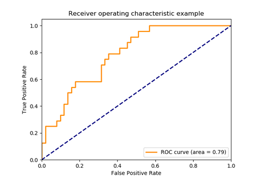
]]

---

# Referències

- T. G. Dietterich. Approximate statistical tests for comparing supervised classification learning algorithms. Neural Computation, 10, 1895-1924.

- Maarten Grootendorst. [_Validating your Machine Learning Model_](https://towardsdatascience.com/validating-your-machine-learning-model-25b4c8643fb7). towards data science, 2019.

- [Metrics and scoring in sklearn](http://scikit-learn.org/stable/modules/model_evaluation.html)

---
class: left, middle, inverse

# Índex

- .brown[Validació de models]

- .cyan[ML en producció]

  - Dades

  - Entrenament

  - Avaluació

  - Inferència

  - Codi

  - Arquitectura

---

# Definició

.large[.blue[Desenvolupament i manteniment de models d'aprenentatge en el món real]]

<br>

#### Conceptes clau:

  - Escalabilitat

  - Monitoratge

  - Seguretat

  - Control de versions

---

# Etapes del proces

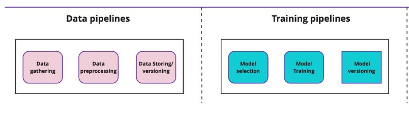

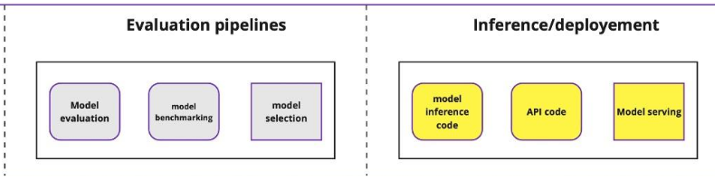

---
class: left, middle, inverse

# Índex

- .brown[Validació de models]

- .cyan[ML en producció]

  - .cyan[Dades]

  - Entrenament

  - Avaluació

  - Inferència

  - Codi

  - Arquitectura

---

# Dades

.cols5050[
.col1[
.blue[*Data gathering*]:

- Repositori de dades

- *Web scraping*

- Anotació d'algun tipus

.blue[Preprocés]:

- Neteja: 

  - valors absents

  - normalització

  - redundàncies

  - *data augmentation*
]
.col2[
.blue[Control de versions]:

- Dades, models i codi

- Tot s'ha d'anotar 

- Còpies de seguretat

]]

---

# Dades en el núvol


---
class: left, middle, inverse

# Índex

- .brown[Validació de models]

- .cyan[ML en producció]

  - .brown[Dades]

  - .cyan[Entrenament]

  - Avaluació

  - Inferència

  - Codi

  - Arquitectura

---

# Entrenament

.blue[Selecció de models]

- Selecció i preparació de models pel cas d'ús

- Entrenament de models amb dades seleccionades i netes

- Disponibilitat de bones dades és un del punts clau

.blue[Entrenament de models]

- Pot trigar més d'un mes depenen de les dades i la màquina

- Hem de guardar el model amb *checkpoints* per evitar pèrdues i aprofitar *early stopping*

.blue[Versionat de models]

- Cada model ha d'estar etiquetat i versionat

- S'han de conservar totes les metadades dels models per ajudar en la comparació

---

# Entrenament en el núvol

.center[
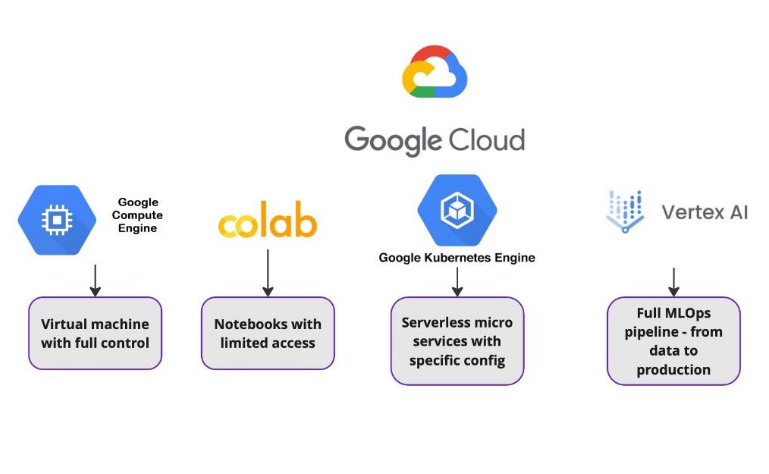

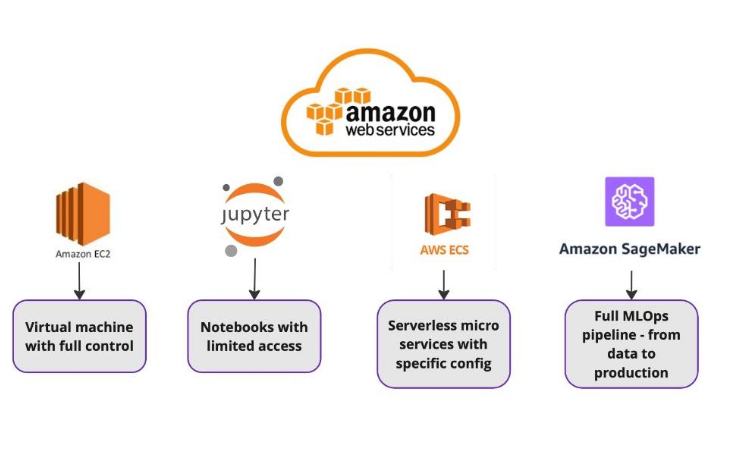
]

---
class: left, middle, inverse

# Índex

- .brown[Validació de models]

- .cyan[ML en producció]

  - .brown[Dades]

  - .brown[Entrenament]

  - .cyan[Avaluació]

  - Inferència

  - Codi

  - Arquitectura

---

# Avaluació

- .blue[Mètrica]: depenen del model i la tasca

  - Llenguatge Natural: Bleu (traducció automàtica), ROUGE (resum), accuracy (classificació de textos), f-score (recuperació d'informació)

  - Imatges: AUC i IoU (detecció d'objectes), f-score i accuracy (classificació d'imatges)


- .blue[Benchmarking]

  - Comparació i estimació de la possibilitat de millorar els models

  - Totes les metadades s'han de guardar entre diferents versions dels models

  - Hem de poder comparar i seleccionar els millors models per producció

---

# Monitoratge en el núvol

.blue[Neptune.ai]:

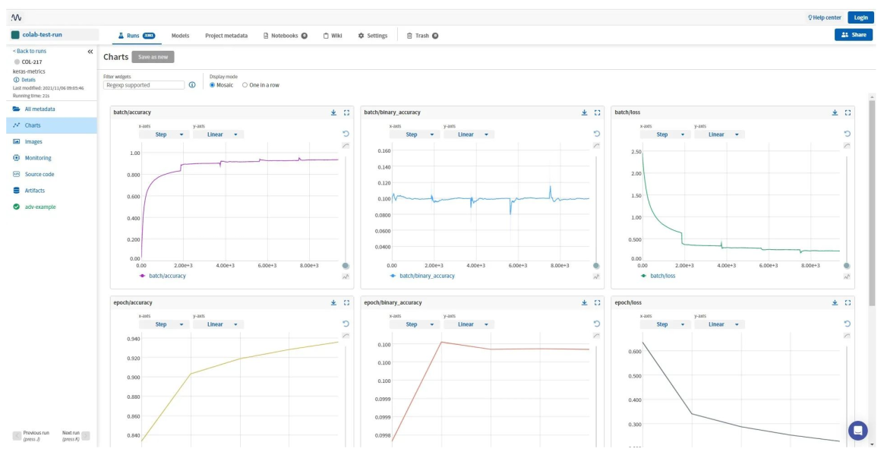

---
class: left, middle, inverse

# Índex

- .brown[Validació de models]

- .cyan[ML en producció]

  - .brown[Dades]

  - .brown[Entrenament]

  - .brown[Avaluació]

  - .cyan[Inferència]

  - Codi

  - Arquitectura

---

# Inferència

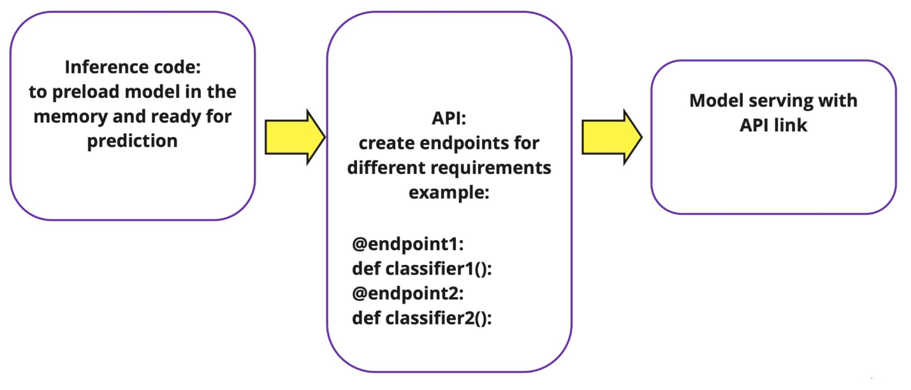
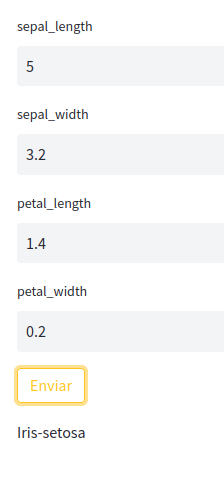

[Exemple amb codi](https://huggingface.co/spaces/gebakx/iris)

---

# Servei de models en el núvol

Ús de microserveis com:

- Kubernetes engine

- Microserveis en el núvol (google cloud RUN o AWS ECS)

- Punts clau:

  - escalabilitat

  - no configuració de màquines virtuals

  - facilitat de monitoratge

  - pujada automàtica

Requeriments:

- Creació d'imatge de projecte amb eines tipus Docker

---
class: left, middle, inverse

# Índex

- .brown[Validació de models]

- .cyan[ML en producció]

  - .brown[Dades]

  - .brown[Entrenament]

  - .brown[Avaluació]

  - .brown[Inferència]

  - .cyan[Codi]

  - Arquitectura

---

# Repositori de codi

.blue[Manteniment del codi dels projectes en repositori]

Característiques:

- **Control de versions**

- **Col·laboració i compartició**

- **Històric de canvis**

- **_Branca & metgin_**

- **Resolució de conflictes**

- **Revisió de codi**

---

# Versi onatge del codi en el núvol

Repositoris:


---
class: left, middle, inverse

# Índex

- .brown[Validació de models]

- .cyan[ML en producció]

  - .brown[Dades]

  - .brown[Entrenament]

  - .brown[Avaluació]

  - .brown[Inferència]

  - .brown[Codi]

  - .cyan[Arquitectura]

---

# Arquitectura complerta exemple

<br>

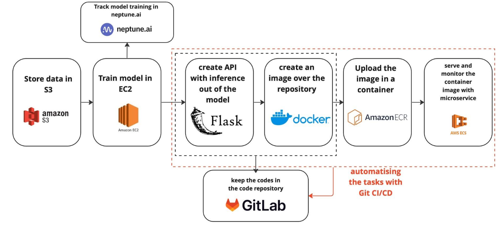
