class: center, middle

## Intel·ligència Artificial

# Xarxes neuronals


.small[[font](https://byteiota.com/object-detection-tensorflow/)]

Gerard Escudero, 2026


---
class: left, middle, inverse

# Índex

- .cyan[Introducció]

  - .cyan[Xarxes neuronals]

  - *Torch*

  - Arquitectures

- Convolucionals

- Sèries Temporals

- *Transfer Learning*

- Xarxes multimodals

- Referència

---

# Model de neurona artificial

.center[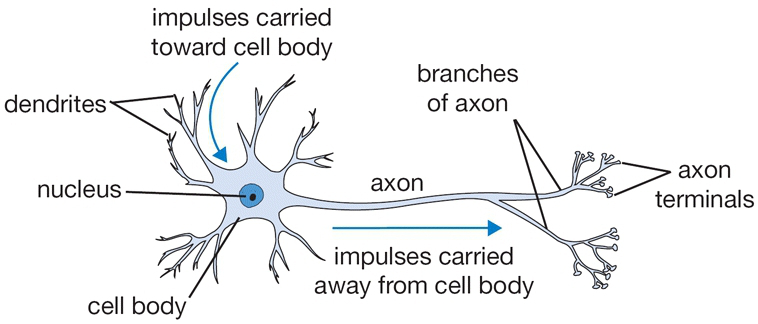]

.center[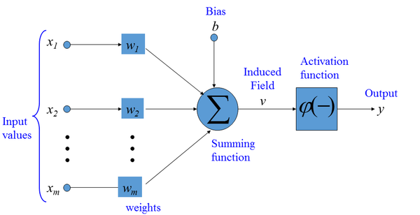]

.footnote[Font: [Artificial Neuron](http://www.gabormelli.com/RKB/Artificial_Neuron)]

---

# Perceptró

.cols5050[
.col1[
- Classificador i regressor 
  - Una neurona (o unitat)
  - Model lineal

- Model: hiperplà
$$\sum_{i=1}^nw_ix_i+b=0$$

- Fórmula de predicció:
$$h(x)=f(\sum_{i=1}^n w_i x_i + b)$$

- [python](codis/perceptron.html) ([codi font](https://github.com/PacktPublishing/Hands-On-Deep-Learning-for-Games))

]
.col2[

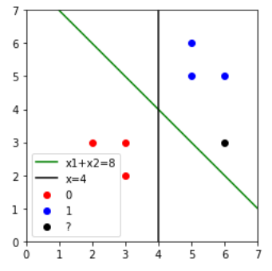

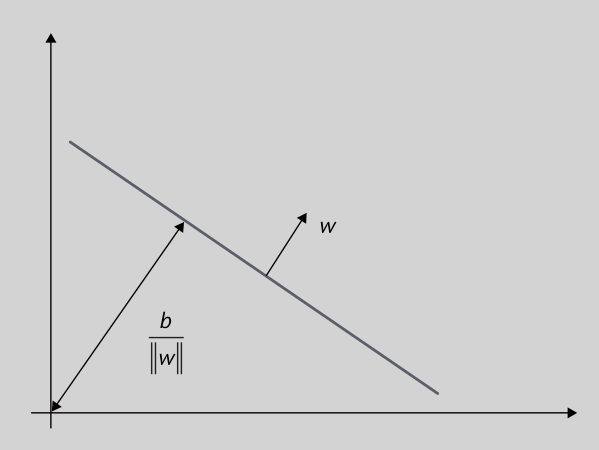

]]


---

# Perceptró multicapa

*MultiLayer Perceptron* o *Feed Forward* network.

.cols5050[
.col1[
- .blue[Classificació i regressió]
  - Una capa oculta
  - Model no lineal

- Predicció:
  - Propagació endavant (*forward propagation*):
$$h(x)=f(\sum_{i=1}^n w_i x_i + b)$$

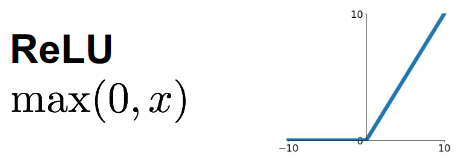
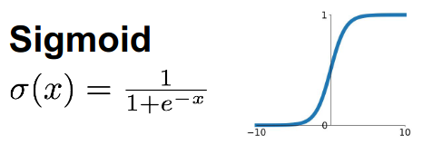

.center[[font](http://cs231n.stanford.edu/slides/2017/cs231n_2017_lecture6.pdf)]
]
.col2[
.center[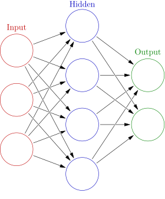]
.center[[font](https://en.wikipedia.org/wiki/Artificial_neural_network)]
]]

---

# Capacitats del MLP

.cols5050[
.col1[
.center[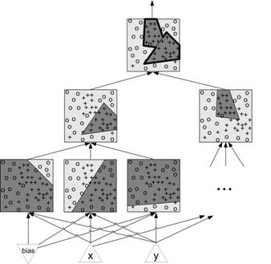]
]
.col2[
.blue[Aprenentatge Profund]: <br>
diverses capes ocultes

.center[
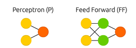

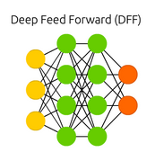
]
]]

.footnote[Font: ([esquerra](http://www.neural-forecasting.com/mlp_neural_nets.htm)) / ([dreta](https://www.asimovinstitute.org/neural-network-zoo/))]


---

# *Backpropagation*

.blue[Algoritme d'aprenentatge]: determinant pesos i biaixos

.center[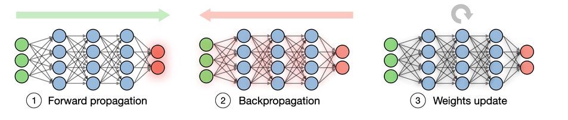]
.center[[font](https://stanford.edu/~shervine/teaching/cs-230/cheatsheet-deep-learning-tips-and-tricks)]

.cols5050[
.col1[
.blue[Descens del gradient] (optimització): 
$$W_X^{t+1}=W_X^t-\eta\frac{\partial loss}{\partial W_X}$$

.small[
- $loss$: $error(h(x),y)$
- $\eta$: taxa d'aprenentatge, mida del pas
- $W$: pesos i biaixos
- $t$: pas d'iteració
]
]
.col2[
.center[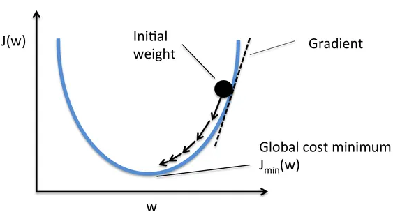]
.center[[font](http://tuxar.uk/brief-introduction-artificial-neural-networks/)]
]]


---

# Exemple de descens de gradient

.cols5050[
.col1[
Sigui la funció:

$f: \mathbb{R}^2\rightarrow\mathbb{R}$

$f(x,y)=(x-2)^2+2(y-3)^2$

Optimització:

$X_{n+1}=X_n-\alpha\nabla f(X_n)$

$\frac{df}{dx}=2x-4$

$\frac{df}{dy}=4y-12$

$x_{n+1}=x_n-\alpha(2x_n-4)$

$y_{n+1}=y_n-\alpha(4y_n-12)$

]
.col2[
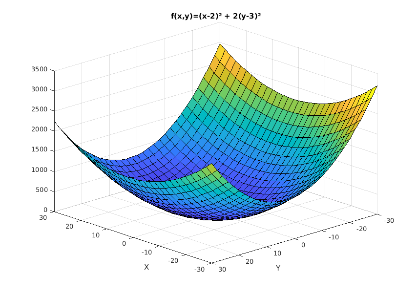

En [python](codis/GradientDescent.html).
]]

.footnote[.red[Font]: [Blog de Lulu](https://lucidar.me/en/neural-networks/gradient-descent-example/)]


---
class: left, middle, inverse

# Índex

- .cyan[Introducció]

  - .brown[Xarxes neuronals]

  - .cyan[*Torch*]

  - Arquitectures

- Convolucionals

- Sèries Temporals

- *Transfer Learning*

- Xarxes multimodals

- Referència

---

# Tensors

.center[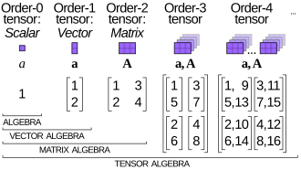<br>
.tiny[[font](https://en.wikipedia.org/wiki/Tensor)]]

```python3
>>> import torch

>>> a = torch.tensor([1, 2])

>>> a, a.shape, type(a), a.dtype
(tensor([1, 2]), torch.Size([2]), <class 'torch.Tensor'>, torch.int64)

>>> torch.dot(a, torch.tensor([3,4]))
tensor(11)
```

---

# *Torch*

Exemple: .blue[Iris]

```python
class Model(nn.Module):
    def __init__(self):
        super().__init__()
        self.net = nn.Sequential(
            nn.Linear(4, 32),      # 4 atributs d'entrada i 32 neurones ocultes
            nn.ReLU(),             # funció activació
            nn.Dropout(0.2),       # Capa de dropout (overfitting)
            nn.Linear(32, 8),      # 2a capa oculta (8 neurones)
            nn.ReLU(),             # funció activació
            nn.Linear(8, 3)        # capa de sortida (3 classes)
        )
    def forward(self, x):
        return self.net(x)

device = torch.device("cuda" if torch.cuda.is_available() else "cpu")
model = Model().to(device)

criterion = nn.CrossEntropyLoss()  # cross-entropy (classificació multiclasse)
optimizer = torch.optim.Adam(model.parameters())  # optimitzador
```

[Exemple bàsic amb Iris](codis/torch-basic.html)

---

# Paràmetres

.blue[Configuració segons el tipus de problema]:

.center[
| Tasca       | Funció de pèrdua | Capa de Sortida |
|:-----------|:--------------|:-------------|
| Binaria | `BCELoss` | una neurona |
| Multiclasse  | `CrossEntropyLoss` | una neurona per classe |
| Regressió  | `MSELoss` | una neurona |
]

.blue[Paràmetres més importants]:
- Capes ocultes
- Nombre de neurones
- Taxa d'aprenentatge ($\eta$)
- Mida del lot (*batch*): exemples a cada pas
- Iteracions (*epoch*): vegades que s'entrenen tots els exemples

.blue[Documentació]: 

- [PyTorch](https://pytorch.org/)

- Leslie Smith, 2018. [A disciplined approach to neural network hyper-parameters.](https://arxiv.org/abs/1803.09820)

---

# Nombre de capes / neurones

.center[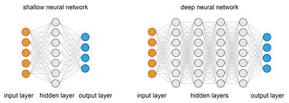<br>
.red[[font](https://blogs.itility.nl/en/deep-neural-network-architecture-lecture-tue)]
]

- .blue[Amplada]: combinacions de variables
  - Apren de memòria totes les combinacions possibles
  - *Overfitting*

- .blue[Profunditat]: inferir característiques d'alt nivell (abstractes)
  - Gradients que desapareixen
  - *Millor elecció* (usualment)

---

# Taxa d'aprenentatge

.center[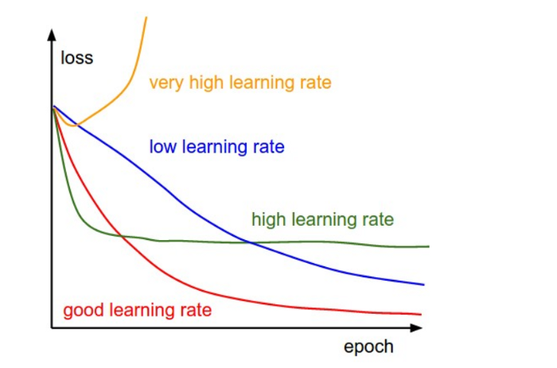<br>
.red[[font](https://towardsdatascience.com/gradient-descent-algorithm-and-its-variants-10f652806a3)]
]

$\eta$: 0.001, 0.003, 0.01, 0.03, 0.1, 0.3

---

# Protocol de validació

.blue[Objectiu principal]: triar:
  - model, 
  - paràmetres i/o 
  - hiperparàmetres

.center[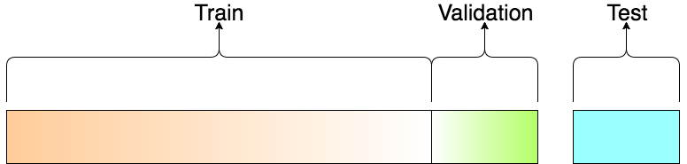<br>
.red[[font](https://tarangshah.com/blog/2017-12-03/train-validation-and-test-sets/)]
]

- .blue[Entrenament] per ajustar $W$

- .blue[Validació] usada a cada iteració/època per monitorar el rendiment 

---

# *Early stopping*

.center[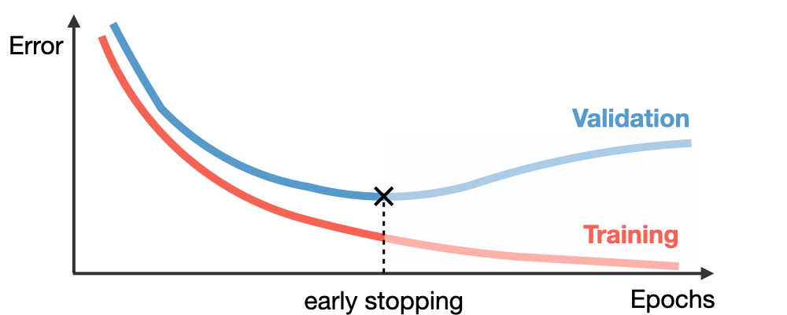<br>
[font](https://stanford.edu/~shervine/teaching/cs-230/cheatsheet-deep-learning-tips-and-tricks)]

---

# *Dropout*

- Eliminar neurones amb una certa probabilitat a cada iteració.

- Minimitza l'*overfitting*.

.center[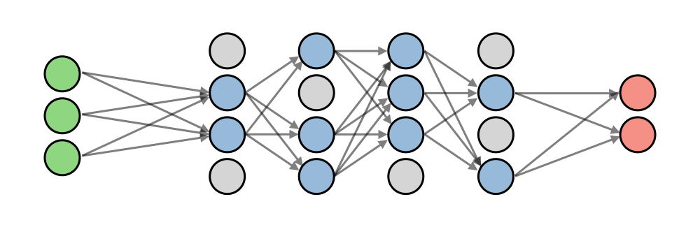<br>
[font](https://stanford.edu/~shervine/teaching/cs-230/cheatsheet-deep-learning-tips-and-tricks)]

[Exemple complert amb Iris](codis/torch-complert.html)

---
class: left, middle, inverse

# Índex

- .cyan[Introducció]

  - .brown[Xarxes neuronals]

  - .brown[*Torch*]

  - .cyan[Arquitectures]

- Convolucionals

- Sèries Temporals

- *Transfer Learning*

- Xarxes multimodals

- Referència

---

# Arquitectures d'Aprenentatge Profund I

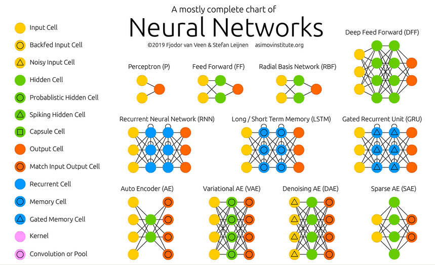

.footnote[Font: [The Neural Network Zoo](https://www.asimovinstitute.org/neural-network-zoo/)]

---

# Arquitectures d'Aprenentatge Profund II

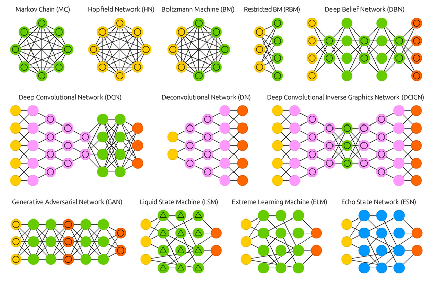

.footnote[Font: [The Neural Network Zoo](https://www.asimovinstitute.org/neural-network-zoo/)]

---

# Arquitectures d'Aprenentatge Profund III

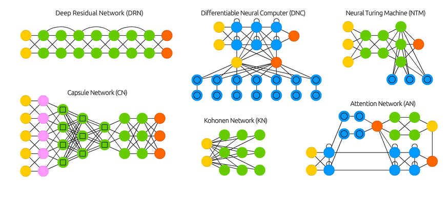

.footnote[Font: [The Neural Network Zoo](https://www.asimovinstitute.org/neural-network-zoo/)]

---
class: left, middle, inverse

# Índex

- .brown[Introducció]

- .cyan[Convolucionals]

  - Classificació d'imatges

  - Detecció de cares

- Sèries Temporals

- *Transfer Learning*

- Xarxes multimodals

- Referència

---

# Tasques de Visió per Computador I

.blue[Classificació d'Imatges]:

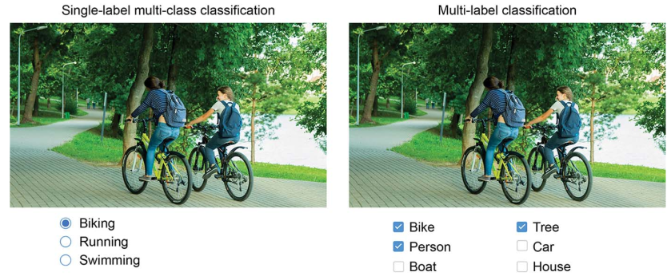

.Blue[Font]: 

- François Chollet. [_Deep Learning with Python_, 2a Edició](https://www.manning.com/books/deep-learning-with-python-second-edition). Manning, 2021.

---

# Tasques de Visió per Computador II

.blue[Segmentació d'imatges i detecció d'objectes]:

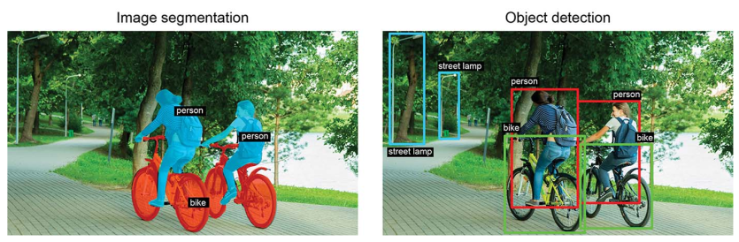

.Blue[Font]: 

- François Chollet. [_Deep Learning with Python_, 2a Edició](https://www.manning.com/books/deep-learning-with-python-second-edition). Manning, 2021.

---

# Conjunt de dades d'exemple per imatges

.blue[The Oxford-IIIT Pet Dataset]

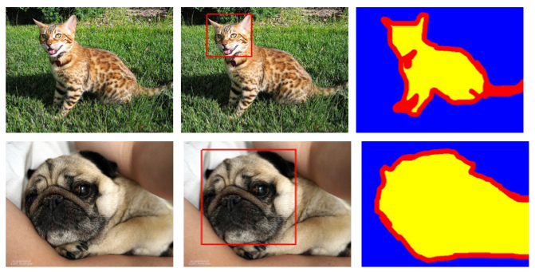

- 2371 gats i 4978 gossos

- [Referència del conjunt de dades](https://www.robots.ox.ac.uk/~vgg/data/pets/)

- [Exemple de processament amb pytorch](https://github.com/limalkasadith/OxfordIIITPet-classification)

---
class: left, middle, inverse

# Índex

- .brown[Introducció]

- .cyan[Convolucionals]

  - .cyan[Classificació d'imatges]

  - Detecció de cares

- Sèries Temporals

- *Transfer Learning*

- Xarxes multimodals

- Referència

---

# Enfocament clàssic

.blue[Aplanar Imatges]:

.center[
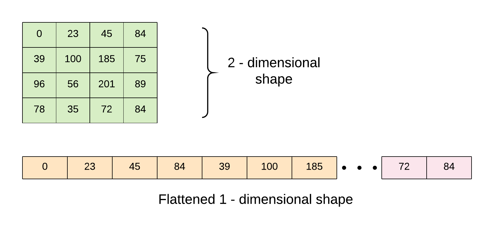<br>
.red[[font](https://ekababisong.org/working-with-keras-gcp/)]
]

.blue[Exemple amb kNN i cares]:

- [Codi exemple de Classificació de Cares](codis/classic-imatges.html)

---

# Processament d'imatges: problema 1

.cols5050[
.col1[
El perceptró multicapa espera un vector (1D) com a entrada

.center[
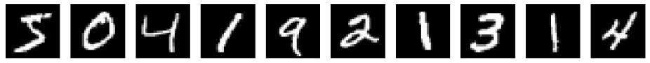
]

.blue[Solució]: transformar imatge (2D) a vector (concatenar files de
píxels)

.blue[Problema]: es perd el context vertical dels píxels

.blue[Exemple] amb MNIST:

  - [Codi exemple](codis/mlp-imatges.html)
]
.col2[
.center[
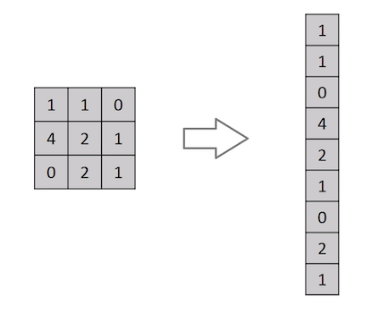<br>
.red[[font](https://towardsdatascience.com/a-comprehensive-guide-to-convolutional-neural-networks-the-eli5-way-3bd2b1164a53)]
]
]]

.center[

]

---

# Processament d'imatges: problema 2

Les imatges en color són 3D (una matriu 2D de píxels per color,
típicament 3: vermell, verd, blau)

.center[
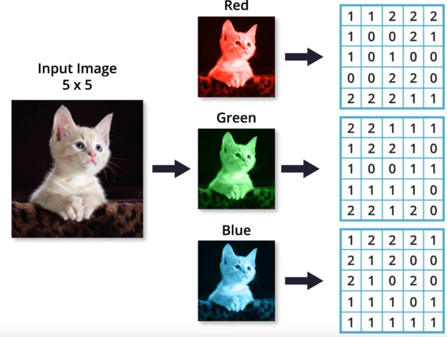<br>
.red[[font](https://www.element14.com/community/people/fmilburn/blog/2019/10/19/a-beginning-journey-in-tensorflow-5-color-image-cnn)]
]

Transformar això a vector: la informació del canal del mateix
píxel es desconnecta

---

# Processament d'imatges: problema 3

Un objecte pot aparèixer en diferents ubicacions de les imatges

.center[
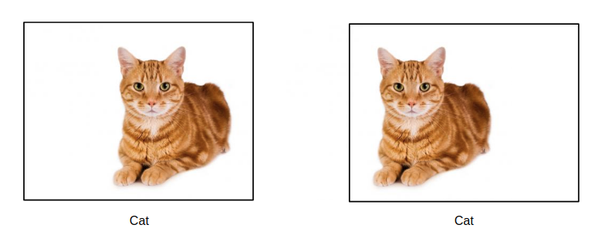<br>
.red[[font](https://www.quora.com/What-is-shift-invariance-in-a-convolutional-neural-network-CNN#pILxT)]
]

MLP espera característiques en posicions fixes: no es moguin!

La detecció d'imatges hauria de ser independent de la posició en la imatge: <br>.blue[Invariància de translació]

---

# Processament d'imatges: problema 4

Un objecte pot tenir diferents mides

.center[
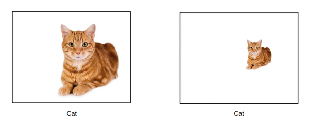<br>
.red[[font](https://www.quora.com/What-is-shift-invariance-in-a-convolutional-neural-network-CNN#pILxT)]
]

Els MLP no poden coincidir amb el mateix patró a diferents mides

La detecció d'imatges hauria de ser independent de l'escala: <br>
.blue[Invariància d'escala]

---

# Processament d'imatges: solucions

Una bona XN per al processament d'imatges hauria de:

- Admetre (i aprofitar!) l'estructura 2D/3D de la imatge

.center[
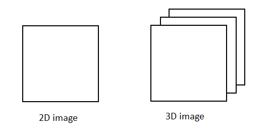<br>
.red[[font](http://datahacker.rs/convolution-rgb-image/)]
]

- Ser invariant a la translació

- Ser invariant a l'escala

---

# Xarxes neuronals convolucionals

per processar imatges i vídeo: 
- .blue[invariants a la translació i escala]
- .blue[eficiència computacional]

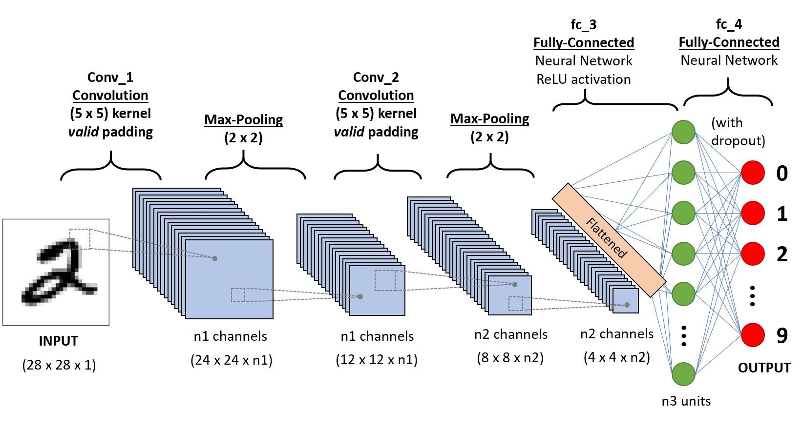

.footnote[Font: [Una Guia Completa de Xarxes Neuronals Convolucionals](https://towardsdatascience.com/a-comprehensive-guide-to-convolutional-neural-networks-the-eli5-way-3bd2b1164a53)]

---

# Convolució

Operació matemàtica sobre dues funcions ($f$ , $g$) (matrius aquí) on el
resultat és la transformació de $f$ quan passa per $g$

.center[
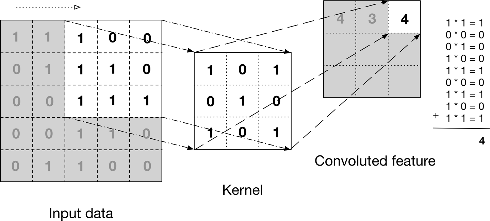<br>
.red[[font](http://www.davidsbatista.net/blog/2018/03/31/SentenceClassificationConvNets/)]
]

---

# Convolució 3D

.center[
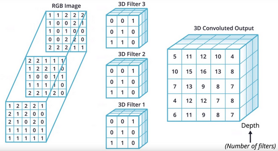<br>
.red[[font](http://datahacker.rs/convolution-rgb-image/)]
]


---

# Exemples de Kernel / Filtre

.center[
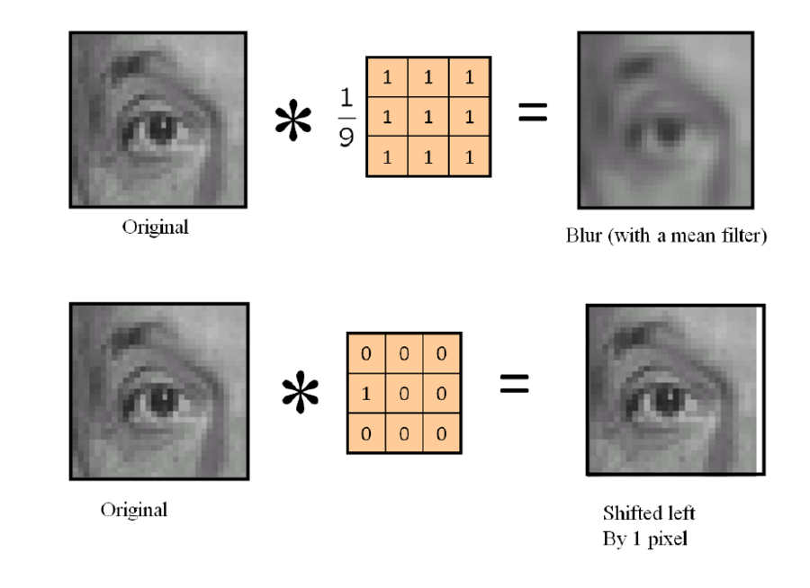<br>
.red[[font](https://blog.naver.com/PostView.nhn?isHttpsRedirect=true&blogId=framkang&logNo=220561249726)]
]

---

# Capa Convolucional

- .blue[Entrenar] diversos filtres (.blue[paràmetre] de la capa) 

- Cada filtre s'especialitza en una característica<br> (línies verticals/horitzontals, cantonades, cercles...)

.blue[Kernels / Filtres]:

.cols5050[
.col1[
- Inicialització aleatòria

- Mida habitual 3x3 o 5x5

- .blue[Padding] (`padding='same'`): marge (valid, same, full)

- .blue[Stride] (`strides=(2, 2)`): quant es mou el filtre a cada pas 
]
.col2[
.center[
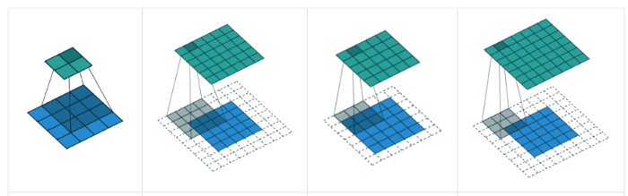<br>
.red[[font](https://towardsdatascience.com/the-most-intuitive-and-easiest-guide-for-convolutional-neural-network-3607be47480)]
]
]]

---

# Mapes de característiques

Resultat de la imatge d'entrada després de passar per un
filtre convolucional

.center[
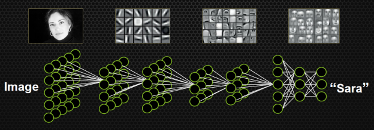<br>
.red[[font](https://developer.nvidia.com/discover/artificial-neural-network)]
]

Un mapa de característiques per filtre per imatge

---

# Pooling

.cols5050[
.col1[
Reduir dimensionalitat per 
  - cost computacional (nombre d'unitats)
  - característiques dominants (invariant rotacional i posicional)
]
.col2[
Operacions:
  - `max` (vores)
  - `average` (foto)


]]

.center[
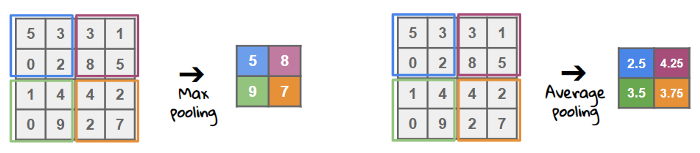<br>
.red[[font](https://towardsdatascience.com/the-most-intuitive-and-easiest-guide-for-convolutional-neural-network-3607be47480)]
]

No requereix entrenament

---

## CNN a Torch

Model amb CNNs:

```python3
class Model(nn.Module):
    def __init__(self):
        super().__init__()
        self.net = nn.Sequential(
            nn.Conv2d(1, 32, kernel_size=3),    # (26,26)
            nn.ReLU(),
            nn.MaxPool2d(kernel_size=2),        # (13,13)
            nn.Conv2d(32, 64, kernel_size=3),   # (11,11)
            nn.ReLU(),
            nn.MaxPool2d(kernel_size=2),        # (5, 5)
            nn.ReLU(),
            nn.Flatten(),
            nn.Linear(in_features=64*5*5, 
                      out_features=10)
        )
    def forward(self, x):
        return self.net(x)
```

- [Codi complert](codis/cnns.html)

---
class: left, middle, inverse

# Índex

- .brown[Introducció]

- .cyan[Convolucionals]

  - .brown[Classificació d'imatges]

  - .cyan[Detecció de cares]

- Sèries Temporals

- *Transfer Learning*

- Xarxes multimodals

- Referència

---

# Detecció de Cares i Objectes

.center[
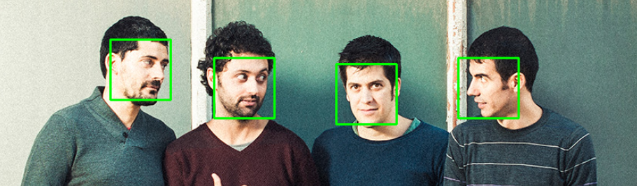
]

- [Codi exemple](codis/deteccio-cares.html)

.cols5050[
.col1[
.blue[Detecció d'Objectes]:

- [YOLO (You Only Look Once)](https://github.com/ultralytics/ultralytics)

  - [Documentacio](https://docs.ultralytics.com/)

- [RetinaNet](https://github.com/yhenon/pytorch-retinanet)
]
.col2[
.blue[Exemple amb codi]:

- Aurélien Geron. [*Hands-On Machine Learning with Scikit-Learn and PyTorch*](https://github.com/ageron/handson-mlp/blob/main/12_deep_computer_vision_with_cnns.ipynb). Github, 2025.

  - Segmentació d'imatges

  - Detecció d'objectes

  - *Transfer Learning*
]]

---
class: left, middle, inverse

# Índex

- .brown[Introducció]

- .brown[Convolucionals]

- .cyan[Sèries Temporals]

  - .cyan[Enfocament Clàssic]

  - Xarxes neuronals

- *Transfer Learning*

- Xarxes multimodals

- Referència

---

# Dades amb temps (seqüències)

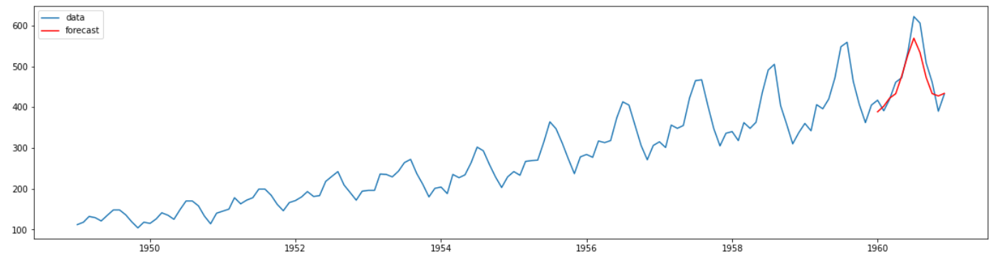

- Temperatures, preus, població

- Text, parla

- Seqüències genòmiques, àtoms en molècules...

- Moviments (telèfon mòbil, sensors, cardio...)

- Paquets de xarxa (detecció d'intrusions)

Les mostres no són independents (els algoritmes estàndard no tenen memòria!)

---

# Finestres lliscants

Primer enfocament: agafar n mostres de cop (últimes $n$ mostres)

.center[
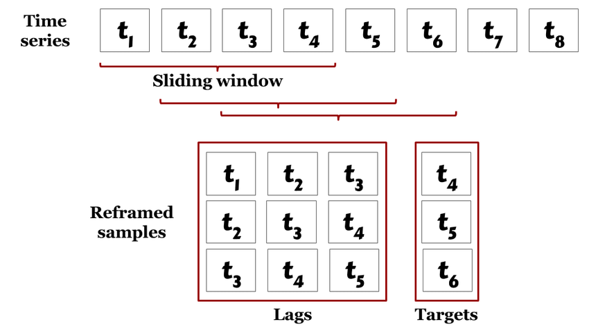<br>
.red[[font](https://www.researchgate.net/figure/A-depiction-of-how-a-time-series-is-transformed-into-a-supervised-learning-problem-using_fig2_330227565)]
]

- .blue[Pros]: pots usar algoritmes estàndard

- .blue[Contres]: definir la mida de la finestra, preparar les dades, complex amb entrades de mida vectorial

---

# Arima

Biblioteca estadística de Python amb capacitats d'anàlisi de sèries temporals.

.cols5050[
.col1[
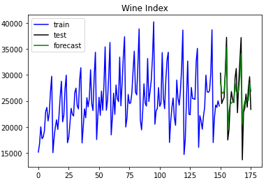
]
.col2[
<br>
- [Paquet Python](https://github.com/alkaline-ml/pmdarima)

- [Documentació](https://alkaline-ml.com/pmdarima/index.html)

- [El model](https://alkaline-ml.com/pmdarima/tips_and_tricks.html)
]]

---
class: left, middle, inverse

# Índex

- .brown[Introducció]

- .brown[Convolucionals]

- .cyan[Sèries Temporals]

  - .brown[Enfocament Clàssic]

  - .cyan[Xarxes neuronals]

- *Transfer Learning*

- Xarxes multimodals

- Referència

---

# Xarxa Neuronal Recurrent

Alimentar les sortides anteriors com entrades addicionals

.center[
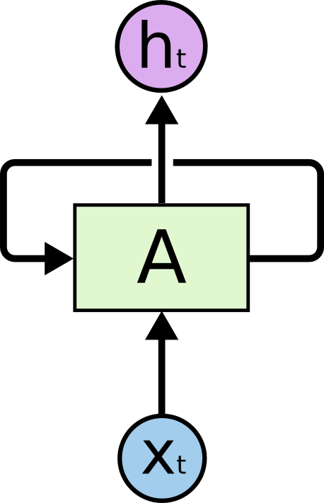<br><br>
Les RNN tenen bucles <br>
.red[[font](http://colah.github.io/posts/2015-08-Understanding-LSTMs/)]
]

.blue[Problema]: gradients que s'esvaeixen/exploten <br>


---

# Memòria a Curt i Llarg Termini

.cols5050[
.col1[
.center[
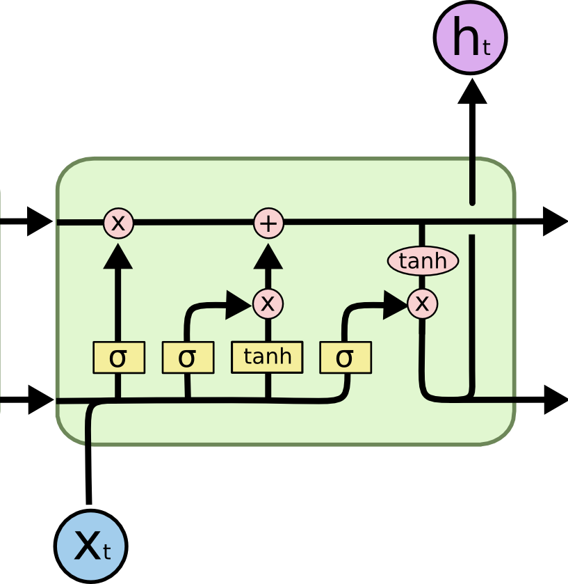<br>
Cel·la LSTM
]
]
.col2[
- GRU: variant de LSTM

- Millor per text/parla

.center[
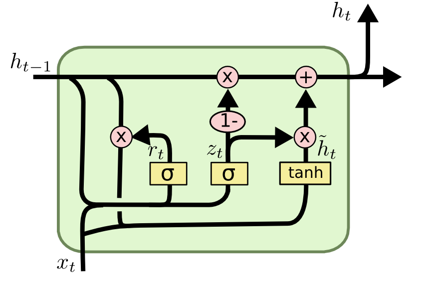<br>
Cel·la GRU
]
]]

Entrenable a la pràctica (sense gradients que s'esvaeixen/exploten)

.footnote[Font: [Understanding LSTM Networks](http://colah.github.io/posts/2015-08-Understanding-LSTMs/)]

---

# Sèries temporals en Torch

```python3
class LSTMModel(nn.Module):
    def __init__(self, input_size=1, hidden_size=100, 
                       output_size=1, num_layers=1):
        super().__init__()
        self.lstm = nn.LSTM(input_size, hidden_size, num_layers, 
                            batch_first=True)
        self.linear = nn.Linear(hidden_size, output_size)
    
    def forward(self, x):
        h0 = torch.zeros(self.lstm.num_layers, x.size(0), 
                         self.lstm.hidden_size).to(x.device)
        c0 = torch.zeros(self.lstm.num_layers, x.size(0), 
                         self.lstm.hidden_size).to(x.device)
        out, _ = self.lstm(x, (h0, c0))
        out = out[:, -1, :]
        out = self.linear(out)
        return out
```

- [Dades Air Passengers](dades/AirPassengers.csv)

- [Codi exemple](codis/lstm.html) 

---
class: left, middle, inverse

# Índex

- .brown[Introducció]

- .brown[Convolucionals]

- .brown[Sèries Temporals]

  - .brown[Enfocament Clàssic]

  - .brown[Xarxes neuronals]

- .cyan[*Transfer Learning*]

- Xarxes multimodals

- Referència

---

# *Transfer Learning*

Resoldre un problema inicialitzant els pesos de la xarxa a partir d'una xarxa de problemes similars, apresos prèviament.

**Curriculum learning**: aprenentatge per ètapes incrementals.

.cols5050[
.col1[
### Hugging Face

[Hugging Face](https://huggingface.co/) és un repositori de models entrenats (també dades i demos).

### Open Neural Network eXchange

[ONNX](https://onnx.ai/) és un format obert construït per representar models d'aprenentatge automàtic. 

**Recursos**: [Github](https://github.com/onnx/onnx)
]
.col2[
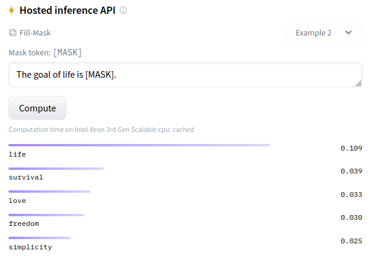
]]

---

# Exemple amb la ResNet

```python3
class ResNet_Classifier(torch.nn.Module):
    def __init__(self, weights, freeze_weights, dropout):
        super(ResNet_Classifier, self).__init__()
        # Load the ResNet model
        resnet = torchvision.models.resnet34(weights=weights)
        out_features = 512    
        #Freezing the weights
        if freeze_weights:
            for param in resnet.parameters():
                param.requires_grad = False
        # Remove the final layer
        base_model = nn.Sequential(*list(resnet.children())[:-1])

        self.layers = nn.Sequential( 
                                        base_model,
                                        nn.Flatten(),
                                        nn.Linear(out_features, 512),
                                        nn.ReLU(),
                                        nn.Dropout(dropout),
                                        nn.Linear(512, 37)
                                    )
        
    def forward(self, x):
        return self.layers(x)
```

[font](https://github.com/limalkasadith/OxfordIIITPet-classification/blob/main/Fine-tune-ResNet34.ipynb)


---
class: left, middle, inverse

# Índex

- .brown[Introducció]

- .brown[Convolucionals]

- .brown[Sèries Temporals]

  - .brown[Enfocament Clàssic]

  - .brown[Xarxes neuronals]

- .brown[*Transfer Learning*]

- .cyan[Xarxes multimodals]

- Referència

---

# Exemple amb dues entrades

Entrada del sepal i el petal per separat (Iris)

```python3
class Model(nn.Module):
    def __init__(self):
        super().__init__()
        self.sepal_layer = nn.Sequential(
            nn.Linear(2, 10), nn.ReLU())
        self.petal_layer = nn.Sequential(
            nn.Linear(2, 10), nn.ReLU())
        self.ocultes = nn.Sequential(
            nn.Linear(20, 8), nn.ReLU(), nn.Linear(8, 3))

    def forward(self, X_sepal, X_petal):
        sepal = self.sepal_layer(X_sepal)
        petal = self.petal_layer(X_petal)
        juntes = torch.concat((sepal, petal), dim=1)
        return self.ocultes(juntes)
```

[Codi exemple](codis/multiinput.html)

---

# Exemple amb dues sortides

Sortida petal-width i classe (Iris)

```python3
class Model(nn.Module):
    def __init__(self):
        super().__init__()
        self.ocultes = nn.Sequential(
            nn.Linear(3, 20), nn.ReLU(),
            nn.Linear(20, 8), nn.ReLU(),
        )
        self.petal_layer = nn.Linear(8, 1)
        self.class_layer = nn.Linear(8, 3)

    def forward(self, X):
        ocultes = self.ocultes(X)
        petal_output = self.petal_layer(ocultes)
        class_output = self.class_layer(ocultes)
        return petal_output, class_output
```

[Codi exemple](codis/multioutput.html)

---

# Xarxes Siameses

.center[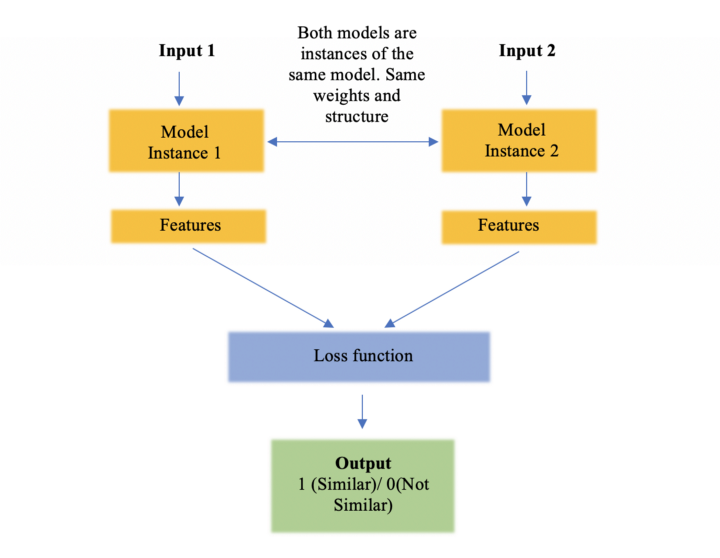]

.footnote[Font: [Siamese Networks Introduction and Implementation](https://towardsdatascience.com/siamese-networks-introduction-and-implementation-2140e3443dee)]

---

# Exemple: similitut entre gats i gossos

.cols5050[
.col1[
- Punt de partida: <br>[Oxford-IIIT Pet Dataset](https://www.robots.ox.ac.uk/~vgg/data/pets/)

- .blue[Conjunt de dades]:
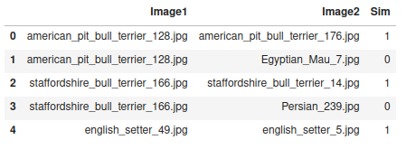

- Per cada image:

  - Parella aleatòria positiva

  - Parella aleatòria negativa

]
.col2[
- Resultat: <br>
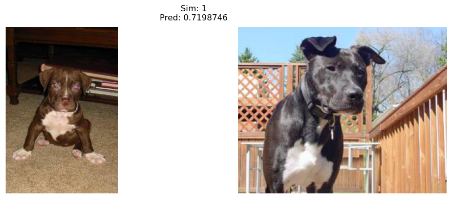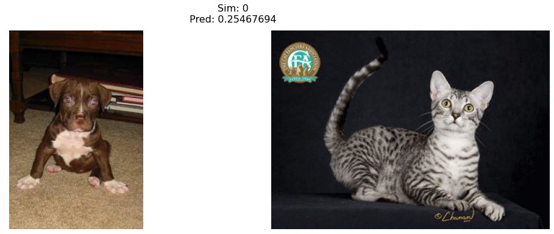
]]

---
class: left, middle, inverse

# Índex

- .brown[Introducció]

- .brown[Convolucionals]

- .brown[Sèries Temporals]

  - .brown[Enfocament Clàssic]

  - .brown[Xarxes neuronals]

- .brown[*Transfer Learning*]

- .brown[Xarxes multimodals]

- .cyan[Referència]

---

# Referència

- Aurélien Geron. *Hands-On Machine Learning with Scikit-Learn and PyTorch: Concepts, Tools, and Techniques to Build Intelligent Systems*. O'Reilly, 2025.

- Aurélien Geron. [*Hands-On Machine Learning with Scikit-Learn and PyTorch*](https://github.com/ageron/handson-mlp). Github, 2025.
